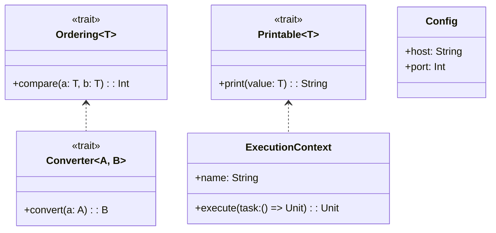

# **Implicits (Scala 3 Given/Using)**

## Overview

POC demonstrating Scala 3's given/using syntax as a replacement for implicits. Covers context parameters, implicit config patterns, type conversions, extension methods for String/Int/List, type classes, and execution contexts.

---

## Tech Stack

- **Language** -> Scala 3
- **Build Tool** -> sbt
- **Testing** -> ScalaTest 3.2.16
- **JDK** -> 25

---

## Architecture Diagram



---

## Setup Instructions

### 1 - Clone

```bash
git clone https://github.com/rbleggi/tech-pocs.git
cd scala-3/implicits
```

### 2 - Build

```bash
sbt compile
```

### 3 - Test

```bash
sbt test
```
