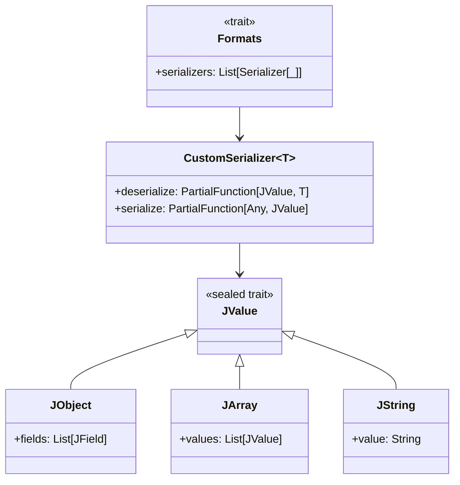

# **json4s Deep Dive**

## Overview

A practical deep-dive into json4s for Scala 3 developers, covering custom serializers for ADTs and enums, advanced JValue transformations, Option/Either/sealed trait handling, error handling, and testing JSON with ScalaTest.

---

## Tech Stack

- **Language** -> Scala 3
- **Build Tool** -> sbt
- **Testing** -> ScalaTest 3.2.16
- **JDK** -> 25
- **json4s** -> JSON serialization library for Scala

---

## Architecture Diagram



---

## Setup Instructions

### 1 - Clone

```bash
git clone https://github.com/rbleggi/tech-pocs.git
cd scala-3/json4s
```

### 2 - Build

```bash
sbt compile
```

### 3 - Test

```bash
sbt test
```
