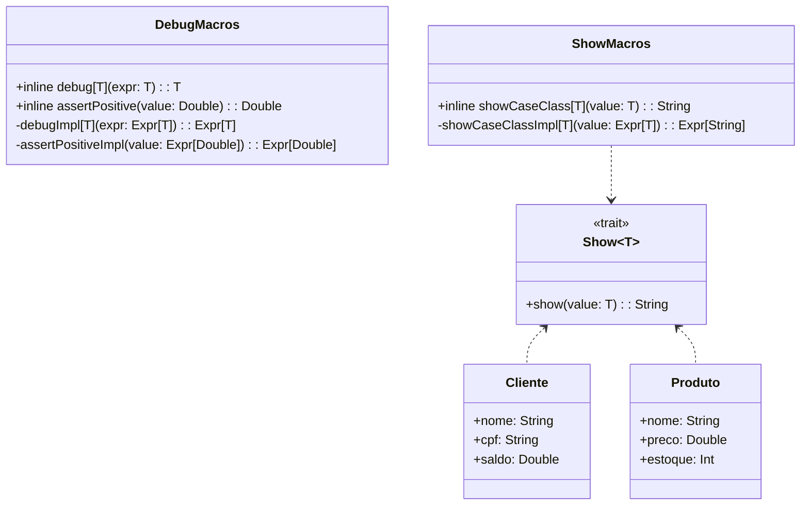

# **Scala 3 Macros**

## Overview

This project demonstrates Scala 3's new macro system using inline definitions and quoted expressions. Macros enable compile-time metaprogramming for debugging, validation, and code generation. The example includes a debug macro for logging expressions and an assertion macro for validating positive values.

---

## Tech Stack

- **Language** -> Scala 3
- **Build Tool** -> sbt
- **Testing** -> ScalaTest 3.2.16
- **JDK** -> 25

---

## Architecture Diagram



---

## Setup Instructions

### 1 - Clone

```bash
git clone https://github.com/rbleggi/tech-pocs.git
cd scala-3/macros
```

### 2 - Build

```bash
sbt compile
```

### 3 - Test

```bash
sbt test
```
