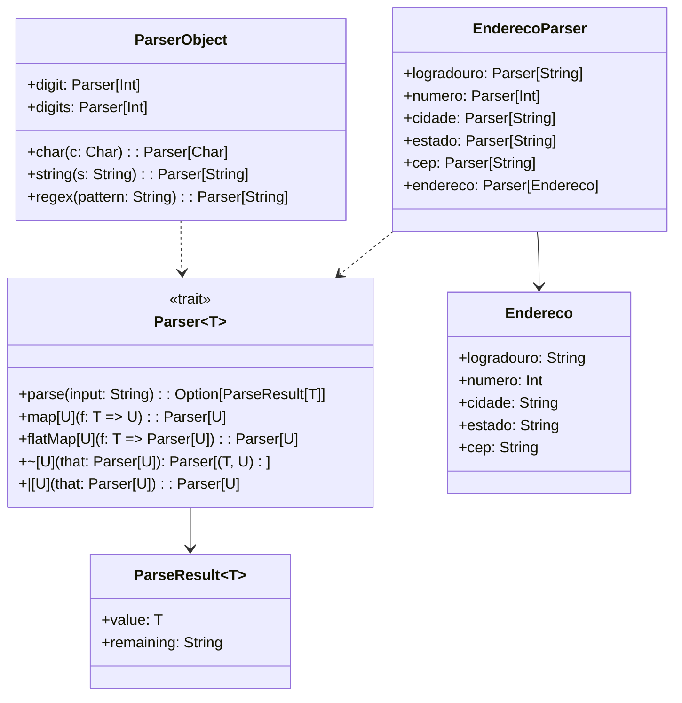

# **Parser Combinators**

## Overview

This project demonstrates a simple parser combinator library in Scala 3. Parser combinators allow building complex parsers from small, reusable components using functional composition. The example parses Brazilian addresses with street, number, city, state, and postal code.

---

## Tech Stack

- **Language** -> Scala 3.6.3
- **Build Tool** -> sbt 1.10.11
- **Runtime** -> JDK 25
- **Testing** -> ScalaTest 3.2.16

---

## Architecture Diagram



---

## Setup Instructions

### 1 - Clone

```bash
git clone https://github.com/rbleggi/tech-pocs.git
cd scala-3/parser-combinators
```

### 2 - Build

```bash
sbt compile
```

### 3 - Test

```bash
sbt test
```
