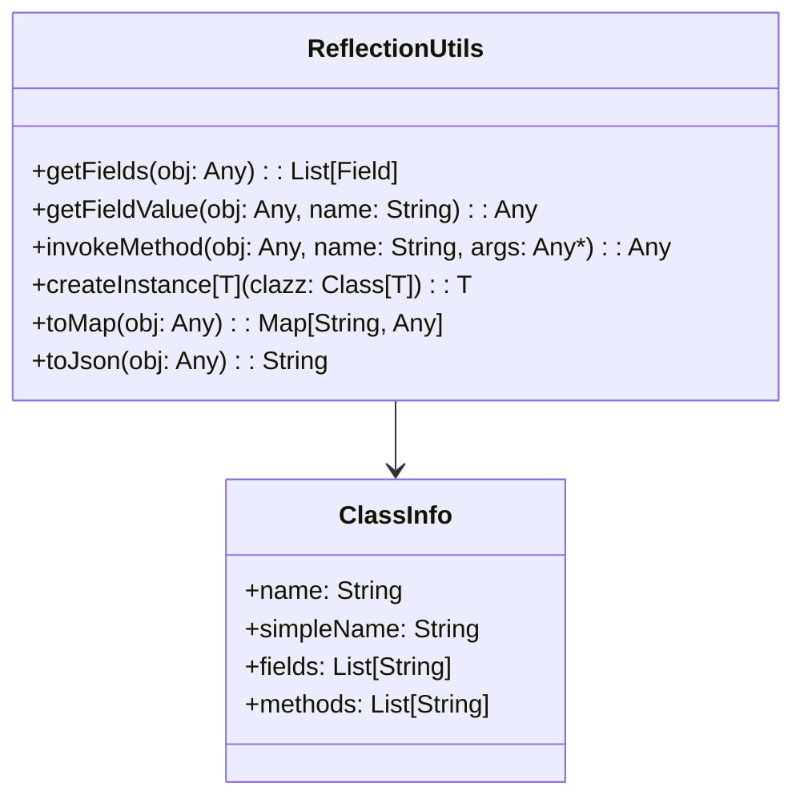

# **Reflection**

## Overview

POC demonstrating runtime reflection in Scala 3 using the Java reflection API. Covers class inspection, field access, method invocation, dynamic instantiation, and generic serialization utilities.

---

## Tech Stack

- **Language** -> Scala 3
- **Build Tool** -> sbt
- **Testing** -> ScalaTest 3.2.16
- **JDK** -> 25

---

## Architecture Diagram



---

## Setup Instructions

### 1 - Clone

```bash
git clone https://github.com/rbleggi/tech-pocs.git
cd scala-3/reflection
```

### 2 - Build

```bash
sbt compile
```

### 3 - Test

```bash
sbt test
```
