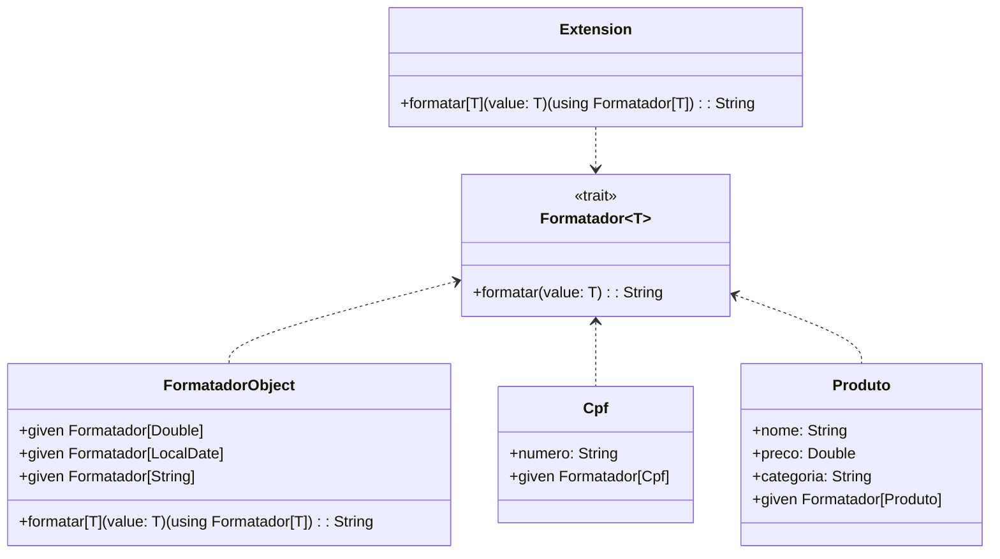

# **Type Classes Pattern**

## Overview

This project demonstrates Scala 3's type classes using the given/using mechanism. Type classes enable ad-hoc polymorphism by defining behavior for types without modifying their definitions. The example shows formatters for Brazilian data types including currency, dates, CPF, and products.

---

## Tech Stack

- **Language** -> Scala 3
- **Build Tool** -> sbt
- **Testing** -> ScalaTest 3.2.16
- **JDK** -> 25

---

## Architecture Diagram



---

## Setup Instructions

### 1 - Clone

```bash
git clone https://github.com/rbleggi/tech-pocs.git
cd scala-3/type-classes
```

### 2 - Build

```bash
sbt compile
```

### 3 - Test

```bash
sbt test
```
