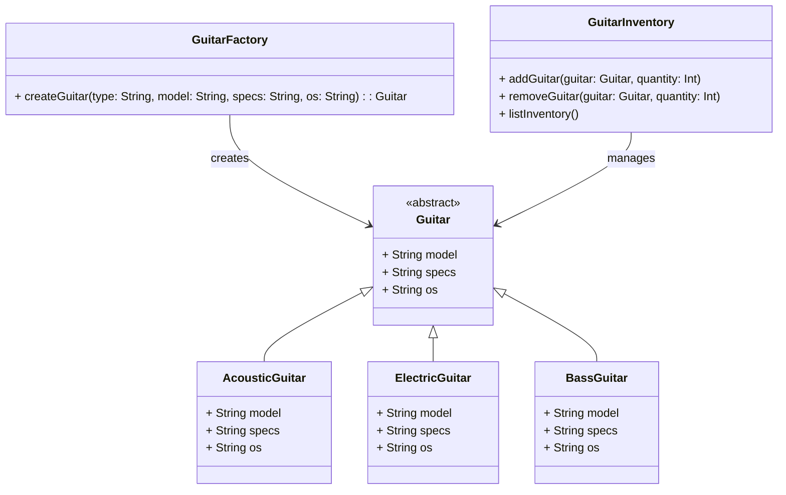

# **Guitar Factory System**

## **Overview**

This project implements a **custom guitar factory system** that allows users to specify **guitar type, model, specifications, and operating system (OS)** to create personalized guitars. The system also manages **inventory**, keeping track of available guitars and their quantities.

The project follows the **Factory Method Pattern** to handle guitar creation dynamically and uses a **Singleton Pattern** to manage the inventory, ensuring a centralized and consistent stock management system.

### **Tech Stack**
- **Scala 3.6** → Modern JVM-based language with functional programming support.
- **SBT** → Scala's build tool for managing dependencies and compiling code.
- **JDK 21** → Required for running the application.

---

## **Features**
✔ **Custom Guitar Creation** → Users can specify guitar types, models, and OS.  
✔ **Inventory Management** → Keep track of available guitars.  
✔ **Factory Method Pattern** → Creates different guitar types dynamically.  
✔ **Singleton Inventory** → Ensures centralized stock control.  
✔ **Scalability** → Easy to add new guitar types and extend functionality.

---

## **Class Diagram**

The following diagram represents the core structure of the **Guitar Factory System**:



---

## **Factory Method Pattern**
The **Factory Method Pattern** is used to **simplify the creation of different guitar types** dynamically. Instead of hardcoding guitar creation logic, the system:
1. **Uses `Guitar` as a base trait** for all guitars.
2. **Implements specific guitar classes (`AcousticGuitar`, `ElectricGuitar`, `BassGuitar`)** to represent different types.
3. **Delegates the creation process to `GuitarFactory`**, which returns the appropriate guitar instance based on user input.

This design makes the system **scalable, flexible, and easy to extend** when adding new guitar types.

---

## **Singleton Pattern**
The **Singleton Pattern** is used to **ensure that there is a single instance of the inventory management system** throughout the application's lifecycle. Instead of creating multiple instances of an inventory class (which could lead to inconsistencies), the system:
1. **Uses `GuitarInventory` as a Singleton Object**, meaning only one instance exists at runtime.
2. **Centralizes inventory data**, ensuring that all parts of the application interact with the same inventory.
3. **Provides global access to stock operations (`addGuitar`, `removeGuitar`, `listInventory`)**, ensuring consistency in stock management.

This design choice **prevents duplicate inventories** and ensures that all operations (adding, removing, and listing guitars) are performed on a single, reliable data source.

---

## **Setup Instructions**

### **1️⃣ Clone the Repository**
```bash
git clone https://github.com/your-repo/guitar-factory.git
cd guitar-factory
```

### **2️⃣ Compile & Run the Application**
```sh
./sbtw compile run
```

### **3️⃣ Run Tests**
```sh
./sbtw test
```