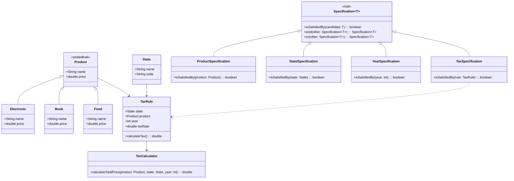

# TAX System Project

## Overview

This project demonstrates a tax calculation system where different products are subject to different tax rates based on the state and year.

- **Scala 3.6** → A powerful JVM-based language with strong functional programming capabilities.

## Features

- **Product-based Taxation**: Different products have distinct tax rates.
- **State-Specific Taxes**: Each state may define its own tax rates.
- **Yearly Tax Changes**: Taxes can change depending on the year.
- **Scalable Architecture**: Designed for easy expansion and modification.
- **Specification Pattern**: Clearly defines flexible and reusable tax rule criteria (e.g., product, state, and year).

## Class Diagram

Below is a **UML class diagram** representing the core structure of the TAX system:



---

## Prerequisites

- **JDK 21** → Ensure Java is installed.
- **SBT** → Used for dependency management.

## Setup Instructions

1. **Clone the Repository**:
   ```bash
   git clone https://github.tlcinternal.com/rbleggi/tech-pocs.git
   cd scala-3.6/tax-system
   ```

2. **Compiling & Running**:
   ```sh
   ./sbtw compile run 
   ```

3. **Compiling & Tests**
   ```sh
   ./sbtw compile test
   ```