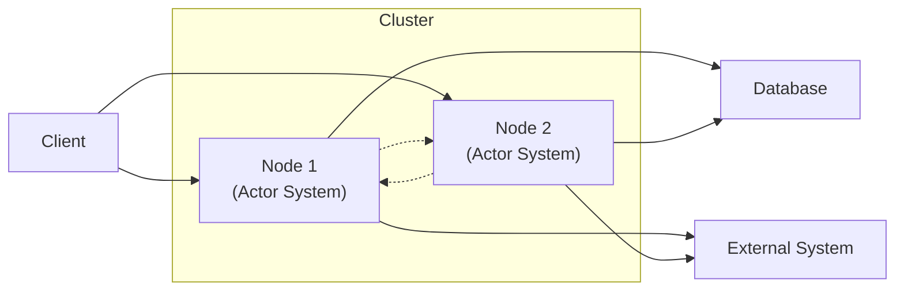
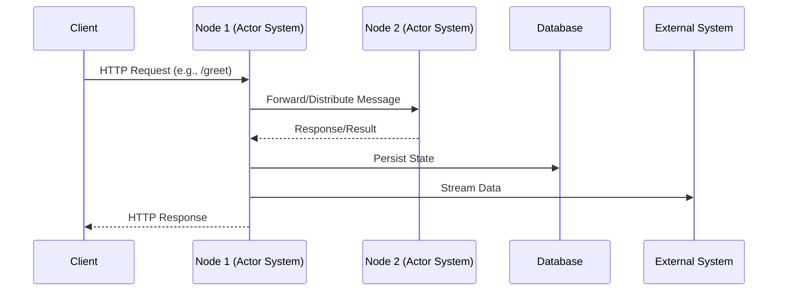
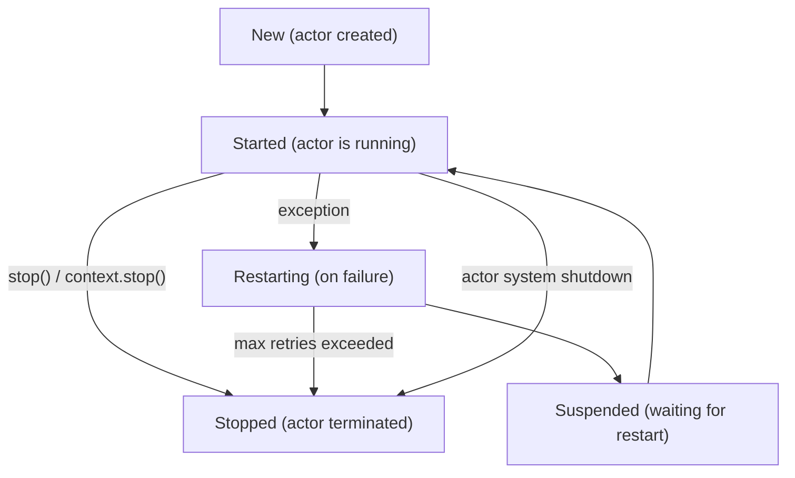

# Pekko: Actor-based Concurrency for the JVM

---

## Slide 1: History and Origins
**Relacionado ao Script: Minute 1**

- Pekko is an open-source toolkit for building concurrent, distributed, and resilient message-driven applications on the
  JVM.
- Forked from Akka in 2023 after licensing changes.
- Now maintained by the Apache Software Foundation.

---

## Slide 2: Main Features
**Relacionado ao Script: Minute 2**

- **Actor Model:** Lightweight, isolated actors communicate via asynchronous messages.
- **Clustering:** Build distributed systems that scale across nodes.
- **Persistence:** Actors can persist state for recovery.
- **Streams:** Reactive streams for async data processing.
- **Typed Actors:** Type-safe APIs.
- **Supervision:** Fault tolerance via supervision trees.
- **Integration:** Works with Scala/Java.

---

## Slide 3: Pekko Modules
**Relacionado ao Script: Minute 2**

- **pekko-actor-typed**: Typed, type-safe actors (core concurrency model)
- **pekko-actor**: Classic actors (legacy)
- **pekko-cluster**: Clustering support for distributed actor systems
- **pekko-persistence**: Event sourcing and state persistence for actors
- **pekko-stream**: Reactive streams for data processing
- **pekko-http**: HTTP server and client for building REST APIs
- **pekko-serialization**: Serialization support for messages
- **pekko-remote**: Remote communication between actor systems
- **pekko-management**: Cluster management and bootstrap tools

---

## Slide 4: Architecture Overview
**Relacionado ao Script: Minute 3**




- Diagrama oficial: [Actor System Architecture](https://pekko.apache.org/docs/pekko/current/typed/actors.html#actor-system)
- Clients can connect to any node in the cluster.
- Each node runs its own Actor System and communicates with the other node.
- Nodes persist state to a shared database and can integrate with external systems.
- The cluster provides resilience, scalability, and distributed message processing.

---

## Slide 5: Sequence Diagram Example
**Relacionado ao Script: Minute 3**




- Diagrama oficial: [Message Flow](https://pekko.apache.org/docs/pekko/current/typed/actors.html#message-passing)
- Typical flow: request, message forwarding, persistence, response.

---

## Slide 6: Actor Hierarchy & Supervision
**Relacionado ao Script: Minute 3**


- Diagrama oficial: [Actor Hierarchy](https://pekko.apache.org/docs/pekko/current/typed/actors.html#actor-hierarchy)
- Os atores são organizados em uma árvore de supervisão, onde cada ator pode criar filhos e supervisioná-los.

---

## Slide 7: Supervision Strategies
**Relacionado ao Script: Minute 3**


- Diagrama oficial: [Supervision Strategies](https://pekko.apache.org/docs/pekko/current/typed/supervision.html)
- Estratégias: restart, resume, stop, escalate.

---

## Slide 8: Pekko vs Erlang/OTP
**Relacionado ao Script: Minute 4**

| Feature       | Pekko (Scala/JVM)                                                                         | Erlang/OTP                                             |
|---------------|-------------------------------------------------------------------------------------------|--------------------------------------------------------|
| Language      | Scala/Java                                                                                | Erlang                                                 |
| Ecosystem     | JVM, Java libs                                                                            | Erlang/BEAM (Erlang Virtual Machine)                   |
| Supervision   | Yes                                                                                       | Yes                                                    |
| Hot Code Swap | Limited (JVM does not support full hot code swap; only small changes with external tools) | Native (can update code in production with no downtime) |
| Performance   | High, JVM-tuned                                                                           | High, BEAM-tuned                                       |
| Community     | Growing                                                                                   | Mature                                                 |

---

## Slide 9: Pros and Cons
**Relacionado ao Script: Minute 4**

**Pros:**

- Scalable, resilient
- JVM ecosystem
- Familiar for Java/Scala devs
- Good for distributed systems

**Cons:**

- JVM startup/memory overhead
- Hot code swap not as seamless as Erlang
- Smaller community

---

## Slide 10: Code Example: REST API with Pekko HTTP & Actors
**Relacionado ao Script: Minute 5**

```scala
import org.apache.pekko.actor.typed._
import org.apache.pekko.actor.typed.scaladsl.Behaviors
import org.apache.pekko.http.scaladsl.Http
import org.apache.pekko.http.scaladsl.server.Directives._
import scala.io.StdIn

object Greeter {
  def apply(): Behavior[String] = Behaviors.receive { (ctx, msg) =>
    ctx.log.info(s"Hello, $msg!")
    Behaviors.same
  }
}

object RestApiDemo extends App {
  val system = ActorSystem(Greeter(), "greeterSystem")
  val route = path("greet" / Segment) { name =>
    get {
      system ! name
      complete(s"Greeted $name!")
    }
  }
  val binding = Http().newServerAt("localhost", 8080).bind(route)
  println("Server online at http://localhost:8080/greet/YourName\nPress RETURN to stop...")
  StdIn.readLine()
  binding.flatMap(_.unbind()).onComplete(_ => system.terminate())
}
```

---

## Slide 11: Main Apache Pekko Libraries (Summary)
**Relacionado ao Script: Minute 2**

- **pekko-actor**: Core actor model, lifecycle management, supervision, and routing.
- **pekko-stream**: Reactive stream processing.
- **pekko-http**: Framework for reactive HTTP APIs and servers.
- **pekko-remote**: Remote communication between actors on different JVMs.
- **pekko-cluster**: Clustering and actor distribution.
- **pekko-persistence**: Actor state persistence.
- **pekko-serialization**: Custom message serialization.
- **pekko-typed**: Strongly-typed API for actors, providing compile-time safety.

---

## Slide 12: Code Comparison: Pekko vs Erlang
**Relacionado ao Script: Minute 5**

**Pekko (Scala):**

```scala
import org.apache.pekko.actor.{Actor, ActorSystem, Props}

class HelloActor extends Actor {
  def receive = {
    case "hello" => println("Hello from Pekko!")
  }
}

val system = ActorSystem("MySystem")
val actor = system.actorOf(Props[HelloActor], "helloActor")
// '!' means 'tell': actor tells itself to print "Hello from Pekko!" by sending the message asynchronously
actor ! "hello"
```

**Erlang:**

```erlang
-module(hello_actor).
-behaviour(gen_server).
start() -> gen_server:start_link({local, hello_actor}, ?MODULE, [], []).
init([]) -> {ok, []}.
handle_cast({hello}, State) -> io:format("Hello from Erlang!~n"), {noreply, State}.
```

Usage:

```erlang
hello_actor:start(),
gen_server:cast(hello_actor, {hello}).
```

---

## Slide 13: Actor System Architecture in Pekko
**Relacionado ao Script: Minute 3**

- The **ActorSystem** is the root container that manages the lifecycle of actors.
- Each actor is isolated, processes messages asynchronously, and does not share state.
- The ActorSystem manages supervision, scheduling, routing, and failures.
- Actors can be local or distributed (with pekko-remote/cluster).
- Supervision allows for fault tolerance strategies (restart, resume, stop, escalate).
- The system is extensible with modules for persistence, clustering, streams, etc.

---

## Slide 14: Actor Lifecycle Diagram (Pekko)
**Relacionado ao Script: Minute 3**



- **New:** Actor is created but not yet started.
- **Started:** Actor is running and processing messages.
- **Restarting:** Actor is being restarted due to failure (supervision).
- **Suspended:** Actor is temporarily suspended during restart.
- **Stopped:** Actor is terminated and will not process further messages.

---

## Slide 15: References
**Relacionado ao Script: Todos os minutos**

- [Pekko Documentation](https://pekko.apache.org/)
- [Erlang/OTP Documentation](https://www.erlang.org/doc.html)
