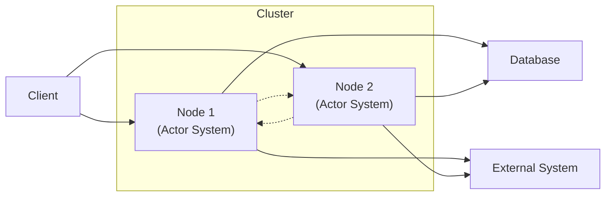

# Pekko 5-Minute Presentation Script

## Minute 1: History and Introduction
- Pekko is an open-source toolkit for building concurrent, distributed, and resilient message-driven applications on the JVM.
- Forked from Akka in 2023 after licensing changes.
- Now maintained by the Apache Software Foundation.

## Minute 2: Main Features & Pekko Libraries
- **Actor Model:** Lightweight, isolated actors communicate via asynchronous messages.
- **Clustering:** Build distributed systems that scale across nodes.
- **Persistence:** Actors can persist state for recovery.
- **Streams:** Reactive streams for async data processing.
- **Typed Actors:** Type-safe APIs.
- **Supervision:** Fault tolerance via supervision trees.
- **Integration:** Works with Scala/Java.

Main Apache Pekko Libraries:
- **pekko-actor**: Core actor model, lifecycle management, supervision, and routing.
- **pekko-stream**: Reactive stream processing.
- **pekko-http**: Framework for reactive HTTP APIs and servers.
- **pekko-remote**: Remote communication between actors on different JVMs.
- **pekko-cluster**: Clustering and actor distribution.
- **pekko-persistence**: Actor state persistence.
- **pekko-serialization**: Custom message serialization.
- **pekko-typed**: Strongly-typed API for actors, providing compile-time safety.

## Minute 3: Architecture & Actor System

- Clients can connect to any node in the cluster.
- Each node runs its own Actor System and communicates with the other node.
- Nodes persist state to a shared database and can integrate with external systems.
- The cluster provides resilience, scalability, and distributed message processing.

## Minute 4: Pekko vs Erlang/OTP & Pros/Cons
| Feature         | Pekko (Scala/JVM) | Erlang/OTP         |
|-----------------|-------------------|--------------------|
| Language        | Scala/Java        | Erlang             |
| Ecosystem       | JVM, Java libs    | Erlang/BEAM        |
| Supervision     | Yes               | Yes                |
| Hot Code Swap   | Limited           | Native             |
| Performance     | High, JVM-tuned   | High, BEAM-tuned   |
| Community       | Growing           | Mature             |

**Pros:**
- Scalable, resilient
- JVM ecosystem
- Familiar for Java/Scala devs
- Good for distributed systems

**Cons:**
- JVM startup/memory overhead
- Hot code swap not as seamless as Erlang
- Smaller community

## Minute 5: Code Example and Demo
```scala
import org.apache.pekko.actor.typed._
import org.apache.pekko.actor.typed.scaladsl.Behaviors
import org.apache.pekko.http.scaladsl.Http
import org.apache.pekko.http.scaladsl.server.Directives._
import scala.io.StdIn
object Greeter {
  def apply(): Behavior[String] = Behaviors.receive { (ctx, msg) =>
    ctx.log.info(s"Hello, $msg!")
    Behaviors.same
  }
}
object RestApiDemo extends App {
  val system = ActorSystem(Greeter(), "greeterSystem")
  val route = path("greet" / Segment) { name =>
    get {
      system ! name
      complete(s"Greeted $name!")
    }
  }
  val binding = Http().newServerAt("localhost", 8080).bind(route)
  println("Server online at http://localhost:8080/greet/YourName\nPress RETURN to stop...")
  StdIn.readLine()
  binding.flatMap(_.unbind()).onComplete(_ => system.terminate())
}
```

---

### SimpleActorDemo.scala (for Minute 5)
```scala
import org.apache.pekko.actor.{Actor, ActorSystem, Props}
class HelloActor extends Actor {
  def receive = {
    case "hello" => println("Hello from Pekko!")
  }
}
val system = ActorSystem("MySystem")
val actor = system.actorOf(Props[HelloActor], "helloActor")
actor ! "hello"
```

## How it works
- The **ActorSystem** is the root container that manages the lifecycle of actors.
- Each actor is isolated, processes messages asynchronously, and does not share state.
- The ActorSystem manages supervision, scheduling, routing, and failures.
- Actors can be local or distributed (with pekko-remote/cluster).
- Supervision allows for fault tolerance strategies (restart, resume, stop, escalate).
- The system is extensible with modules for persistence, clustering, streams, etc.

## Key Points
- Pekko provides a robust toolkit for building concurrent and distributed systems on the JVM.
- Its actor-based model, inspired by Erlang/OTP, offers powerful abstractions for managing state and behavior.
- Pekko's integration with the JVM ecosystem and its Apache Software Foundation backing make it a compelling choice for developers.

## Conclusion
- Pekko is a modern, flexible toolkit for building reactive applications.
- Its strong typing, actor model, and integration with Java/Scala ecosystems provide a powerful platform for developers.
- The growing community and Apache support ensure Pekko's evolution and stability.
