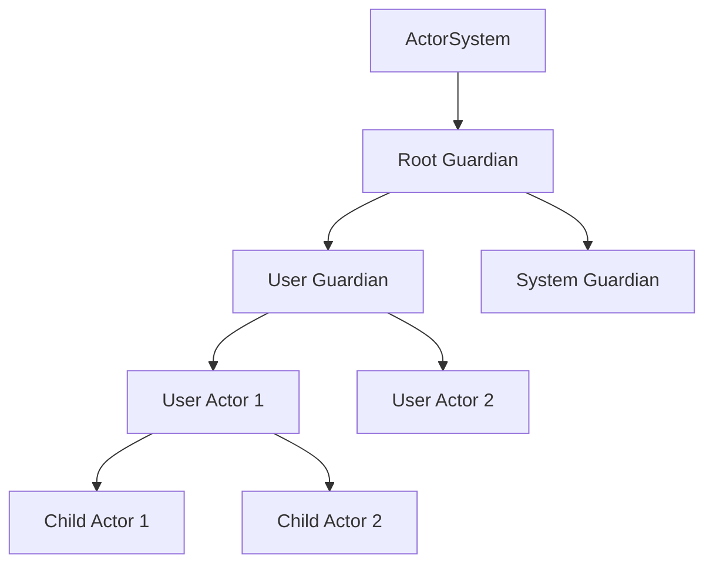
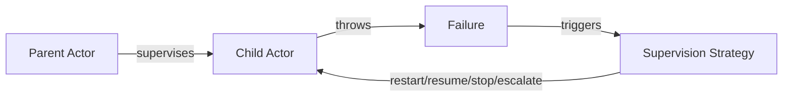
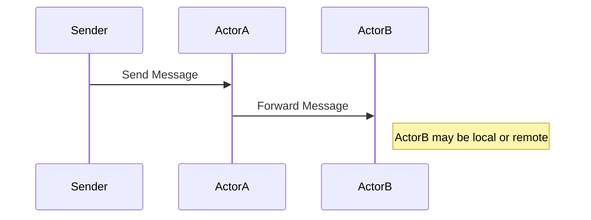

# Pekko 5-Minute Presentation Script

## Minute 1: History and Introduction
**Say:**
- (0s-5s) "Hello everyone. Today, I’ll introduce Apache Pekko."
- (5s-15s) "Pekko is an open-source toolkit for building concurrent, distributed, and resilient applications on the JVM."
- (15s-30s) "It originated as a fork of Akka in 2023, after Akka changed its license."
- (30s-45s) "The open-source community created Pekko to keep a fully open alternative."
- (45s-60s) "Now, Pekko is maintained by the Apache Software Foundation, ensuring open governance."

**Show:**
- Slide: History and Origins (Section 1 of the slide deck)

## Minute 2: Main Features & Pekko Libraries
**Say:**
- (60s-70s) "Pekko’s core is the Actor Model: lightweight, isolated actors that communicate via asynchronous messages."
- (70s-80s) "Key features include clustering for distributed systems, persistence for actor state, reactive streams for data processing, and supervision for fault tolerance."
- (80s-90s) "Main Pekko libraries: pekko-actor (core), pekko-stream (streams), pekko-http (HTTP APIs), pekko-remote (remote actors), pekko-cluster (clustering), pekko-persistence (state persistence), pekko-typed (type-safe actors)."
- (90s-120s) "Pekko integrates seamlessly with Scala and Java, leveraging the JVM ecosystem."

**Show:**
- Slide: Main Features (Section 2)
- Slide: Main Pekko Libraries

## Minute 3: Architecture & Actor System
**Say:**
- (120s-130s) "Let’s look at Pekko’s architecture. Actors are the main building blocks, communicating only by messages."
- (130s-140s) "The ActorSystem is the root container. It manages actor lifecycle, supervision, routing, and failures."
- (140s-150s) "Actors are organized in a hierarchy: each actor can create child actors, forming a supervision tree."
- (150s-160s) "Supervision strategies include restart, resume, stop, and escalate. This ensures resilience and fault tolerance."
- (160s-170s) "Actors communicate asynchronously, and location transparency means you can send messages to actors locally or remotely the same way."
- (170s-180s) "Here’s the actor lifecycle: actors start as 'New', move to 'Started', may go to 'Restarting' and 'Suspended' on failure, and end as 'Stopped'."
- (180s-190s) "The ActorSystem contains the root guardian, which supervises user actors and system actors."

**Show:**
- Slide: Architecture Overview (Section 3)
- Slide: Actor System Architecture
- Slide: Actor Hierarchy Tree (Schema)
- Slide: Supervision Strategies (Schema)
- Slide: Message Flow (Schema)
- Slide: Actor Lifecycle Diagram (Section 'Actor Lifecycle Diagram (Pekko)')

---

### Actor Hierarchy Tree (Official Schema)



---

### Supervision Strategies (Official Schema)



---

### Message Flow (Location Transparency)



---

## Minute 4: Pekko vs Erlang/OTP & Pros/Cons
**Say:**
- (165s-175s) "Comparing with Erlang/OTP: both use the actor model and offer supervision and resilience."
- (175s-185s) "Erlang has native hot code swapping and a mature community, while Pekko benefits from JVM performance and Java/Scala libraries."
- (185s-195s) "Pekko’s strengths: scalability, resilience, JVM integration, and familiar syntax for Java/Scala developers."
- (195s-210s) "Cons: JVM startup and memory overhead, less seamless hot code swapping than Erlang, and a smaller community."

**Show:**
- Slide: Pekko vs Erlang/OTP (Section 4)
- Slide: Pros and Cons (Section 5)

## Minute 5: Code Example and Demo
**Say:**
- (210s-225s) "Let’s see Pekko in action. Here’s a simple actor demo in SimpleActorDemo.scala."
- (225s-240s) "The Greeter actor prints a message when it receives a name."
- (240s-255s) "To run the demo: open SimpleActorDemo.scala and run it with sbt run. You’ll see the actor respond in the console."
- (255s-265s) "Here’s a quick comparison of a hello-world actor in Pekko and Erlang."
- (265s-275s) "Notice the line: greeter ! Greet(\"Pekko User\"). The exclamation mark means 'tell'—greeter tells the actor to greet 'Pekko User' by sending the message asynchronously."
- (275s-300s) "Pekko brings Erlang-style actors to the JVM with strong supervision, clustering, and persistence. Thank you! For more details, see the references in the slide deck."

**Show:**
- Open and show: SimpleActorDemo.scala
- Highlight the Greeter actor and the message sending code
- Show: Code Comparison: Pekko vs Erlang (Section 'Code Comparison: Pekko vs Erlang')
- (Optionally) Run the demo and show the console output

---

### SimpleActorDemo.scala (for Minute 5)

```scala
import org.apache.pekko.actor.{Actor, ActorSystem, Props}

// Define message types for clarity and safety
case class Greet(name: String)
case class Greeted(name: String)

class Greeter extends Actor {
  def receive: Receive = {
    case Greet(name) =>
      println(s"Hello, $name! (from ${self.path.name})")
      sender() ! Greeted(name)
  }
}

object Greeter {
  def props(): Props = Props(new Greeter)
}

@main def run(): Unit = {
  val system = ActorSystem("DemoSystem")
  val greeter = system.actorOf(Greeter.props(), "greeter")
  // '!' means 'tell': greeter tells the actor to greet "Pekko User" by sending the message Greet("Pekko User") asynchronously
  greeter ! Greet("Pekko User")
  Thread.sleep(1000)
  system.terminate()
}
```

## How it works
- `Greeter` receives a name, prints a greeting, and replies.
- The main method sets up the actor system and sends a message to start the flow.
- Actors communicate only via messages (no shared state).
- Pekko provides location transparency and supervision for resilience.

## Key Points
- Modular, scalable, and resilient for modern distributed systems.
- Easy to scale out by adding more actors or nodes.

## Conclusion
- Apache Pekko is a powerful tool for building reactive, distributed systems in Scala and Java.
- Try it out for your next concurrent application!
