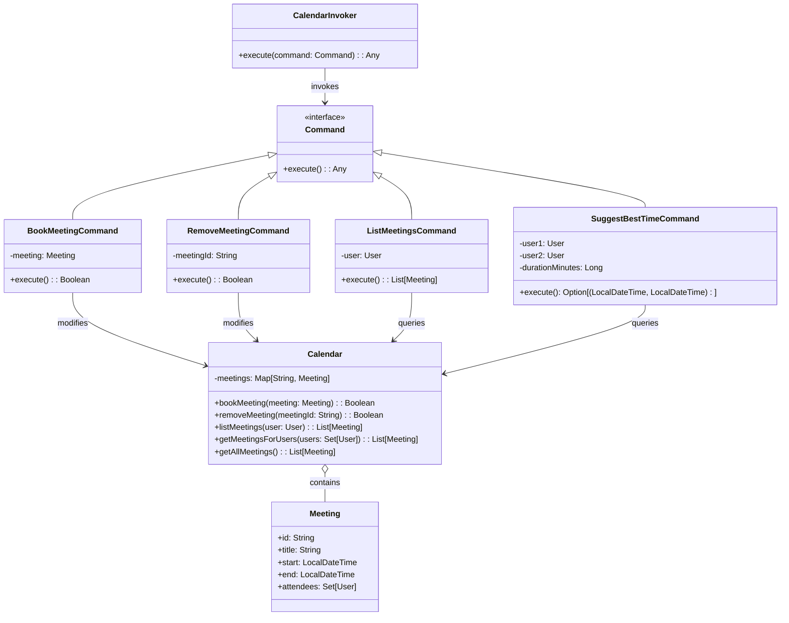

# **Calendar System**

## Overview

This project implements a flexible and maintainable calendar system using the Command Pattern. Users can book meetings, remove meetings, list meetings, and suggest the best time for two people to meet. The system also supports undo and redo functionality for all actions.

---

## Tech Stack

- **Language** -> Scala 3.6.3
- **Build Tool** -> sbt 1.10.11
- **Runtime** -> JDK 25
- **Testing** -> ScalaTest 3.2.16

---

## Architecture Diagram


```mermaid
classDiagram
    direction TB

    class Command {
        <<interface>>
        +execute(): Any
    }

    class BookMeetingCommand {
        -meeting: Meeting
        +execute(): Boolean
    }

    class RemoveMeetingCommand {
        -meetingId: String
        +execute(): Boolean
    }

    class ListMeetingsCommand {
        -user: User
        +execute(): List[Meeting]
    }

    class SuggestBestTimeCommand {
        -user1: User
        -user2: User
        -durationMinutes: Long
        +execute(): Option[(LocalDateTime, LocalDateTime)]
    }

    class Meeting {
        +id: String
        +title: String
        +start: LocalDateTime
        +end: LocalDateTime
        +attendees: Set[User]
    }

    class Calendar {
        -meetings: Map[String, Meeting]
        +bookMeeting(meeting: Meeting): Boolean
        +removeMeeting(meetingId: String): Boolean
        +listMeetings(user: User): List[Meeting]
        +getMeetingsForUsers(users: Set[User]): List[Meeting]
        +getAllMeetings(): List[Meeting]
    }

    class CalendarInvoker {
        +execute(command: Command): Any
    }

    Command <|-- BookMeetingCommand
    Command <|-- RemoveMeetingCommand
    Command <|-- ListMeetingsCommand
    Command <|-- SuggestBestTimeCommand
    BookMeetingCommand --> Calendar: modifies
    RemoveMeetingCommand --> Calendar: modifies
    ListMeetingsCommand --> Calendar: queries
    SuggestBestTimeCommand --> Calendar: queries
    CalendarInvoker --> Command: invokes
    Calendar o-- Meeting: contains
```

---

## Setup Instructions

### 1 - Clone

```bash
git clone https://github.com/rbleggi/tech-pocs.git
cd scala-3/calendar
```

### 2 - Build

```bash
sbt compile
```

### 3 - Test

```bash
sbt test
```
