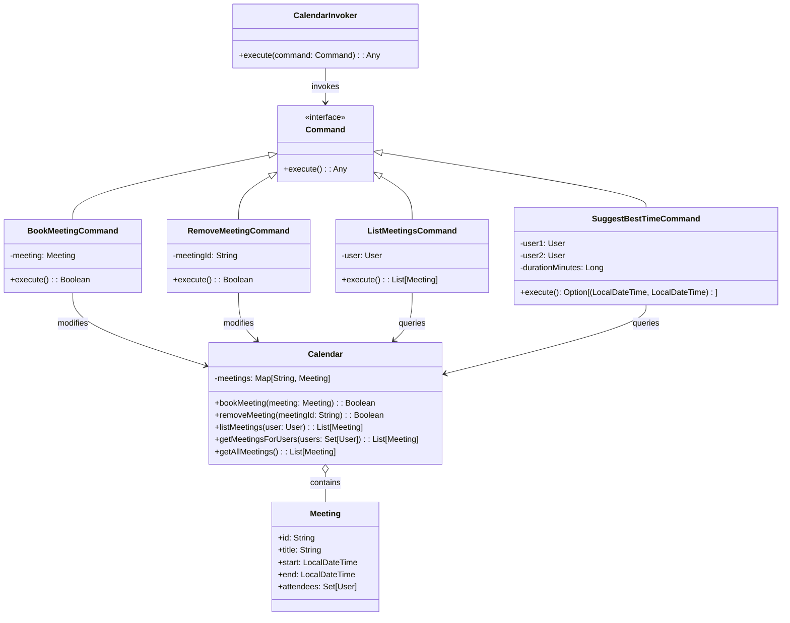

# **Calendar System**

## **Overview**

This project implements a **flexible and maintainable calendar system** using the **Command Pattern**. Users can book meetings, remove meetings, list meetings, and suggest the best time for two people to meet. The system also supports undo and redo functionality for all actions.

### **Tech Stack**

- **Scala 3.6** → Modern JVM-based language with functional programming support.
- **SBT** → Scala's official build tool.
- **JDK 21** → Required to run the application.

---

## **Features**

- **Meeting Management** → Book, remove, list, and suggest meeting times.
- **Command Pattern** → Actions are encapsulated as commands for easy extension.
- **Conflict Detection** → Prevents booking conflicting meetings.
- **Suggestion Engine** → Suggests optimal meeting times based on availability.

---

## **Architecture Diagram**



---

## **Command Pattern**

The **Command Pattern** encapsulates requests as objects, allowing:

- Each calendar action is implemented as a separate `Command`
- `CalendarInvoker` executes commands
- Commands know how to execute themselves
- Easy extension with new commands without modifying existing code
- Clean separation between the invoker and the receiver

---

## **Setup Instructions**

### **1️ - Clone the Repository**

```shell
git clone https://github.com/rbleggi/tech-pocs.git
cd scala-3/calendar
```

### **2️ - Compile & Run the Application**

```shell
./sbtw compile run
```

### **3️ - Run Tests**

```shell
./sbtw compile test
```
