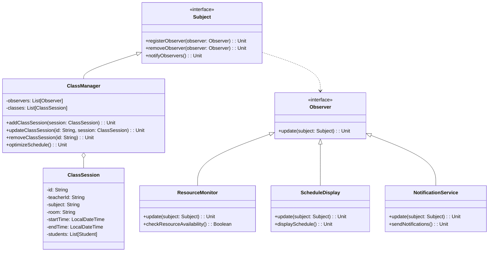

# **Teacher's Class Organizer/Optimizer**

## **Overview**

This project implements a **flexible and efficient classroom organization system** using the **Observer Pattern**. Teachers can manage class schedules, optimize resource allocation, track student assignments, and receive notifications about changes affecting their classes.

---

## **Tech Stack**

- **Scala 3** → Modern JVM-based language with advanced type safety and functional programming features.
- **SBT** → Scala's official build tool.
- **JDK 21** → Required to run the application.

---

## **Features**

- **Class Schedule Management** → Create, update, and optimize class schedules.
- **Resource Allocation** → Assign and track classroom resources efficiently.
- **Student Assignment Tracking** → Monitor student assignments and progress.
- **Notification System** → Receive alerts about schedule conflicts or changes.
- **Optimization Algorithms** → Automatically suggest optimal class arrangements.
- **Observer Pattern Implementation** → Components receive automatic updates when changes occur.

---

## **Architecture Diagram**



---

## **Implementation Details**

The Teacher's Class Organizer uses the Observer Pattern to maintain a loosely coupled design where different components can react to changes in the class schedule or resource allocation without tight dependencies.

- **Subject (ClassManager)**: The central component that maintains the state of classes, schedules, and resources.
- **Observers**: Components like ResourceMonitor, ScheduleDisplay, and NotificationService that respond to changes.
- **Optimization Algorithm**: Analyzes current schedule and resource allocation to suggest improvements.

---

## **Setup Instructions**

### **1️ - Clone the Repository**

```bash
git clone https://github.com/rbleggi/tech-pocs.git
cd scala-3/class-organizer
```

### **2️ - Compile & Run the Application**

```bash
./sbtw compile run
```

### **3️ - Run Tests**

```bash
./sbtw test
```