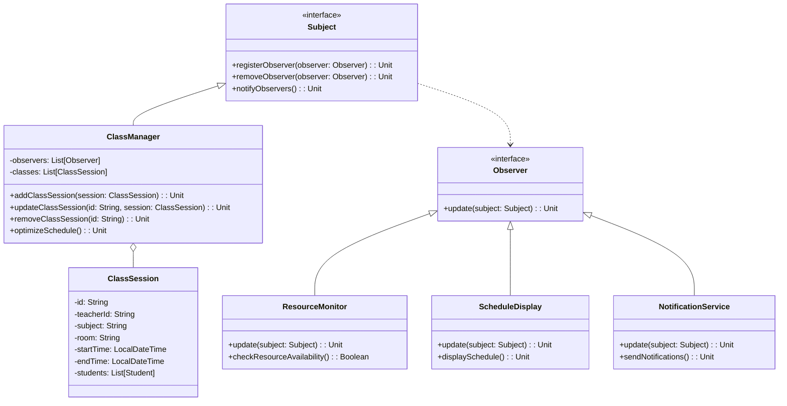

# **Teacher's Class Organizer**

## Overview

This project implements a flexible and efficient classroom organization system using the Observer Pattern. Teachers can manage class schedules, optimize resource allocation, track student assignments, and receive notifications about changes affecting their classes.

---

## Tech Stack

- **Language** -> Scala 3.6.3
- **Build Tool** -> sbt 1.10.11
- **Runtime** -> JDK 25
- **Testing** -> ScalaTest 3.2.16

---

## Architecture Diagram


```mermaid
classDiagram
    direction TB

    class Subject {
        <<interface>>
        +registerObserver(observer: Observer): Unit
        +removeObserver(observer: Observer): Unit
        +notifyObservers(): Unit
    }

    class ClassManager {
        -observers: List[Observer]
        -classes: List[ClassSession]
        +addClassSession(session: ClassSession): Unit
        +updateClassSession(id: String, session: ClassSession): Unit
        +removeClassSession(id: String): Unit
        +optimizeSchedule(): Unit
    }

    class Observer {
        <<interface>>
        +update(subject: Subject): Unit
    }

    class ResourceMonitor {
        +update(subject: Subject): Unit
        +checkResourceAvailability(): Boolean
    }

    class ScheduleDisplay {
        +update(subject: Subject): Unit
        +displaySchedule(): Unit
    }

    class NotificationService {
        +update(subject: Subject): Unit
        +sendNotifications(): Unit
    }

    class ClassSession {
        -id: String
        -teacherId: String
        -subject: String
        -room: String
        -startTime: LocalDateTime
        -endTime: LocalDateTime
        -students: List[Student]
    }

    Subject <|-- ClassManager
    Observer <|-- ResourceMonitor
    Observer <|-- ScheduleDisplay
    Observer <|-- NotificationService
    ClassManager o-- ClassSession
    Subject ..> Observer
```

---

## Setup Instructions

### 1 - Clone

```bash
git clone https://github.com/rbleggi/tech-pocs.git
cd scala-3/class-organizer
```

### 2 - Build

```bash
sbt compile
```

### 3 - Test

```bash
sbt test
```
