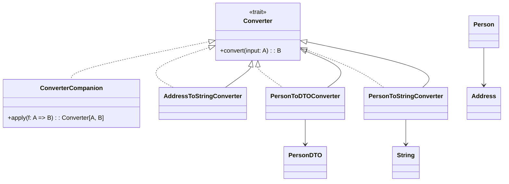

# **Converter Framework**

## **Overview**

A **type-safe, composable framework** for converting between complex types in Scala 3. It enables you to define, compose, and reuse generic converters for any types, following the Adapter Pattern.

---

## **Tech Stack**

- **Scala 3** → Modern JVM-based language with advanced type safety and functional programming features.
- **SBT** → Scala's official build tool.
- **JDK 21** → Required to run the application.

---

## **Features**

- **Generic Converters** → Define converters between any types
- **Composable** → Easily compose and reuse converters
- **Type-Safe** → Compile-time safety for conversions
- **Example Usage** → Includes real-world case class and DTO conversion examples

---

## **Architecture Diagram**



## **Adapter Pattern**

- **Adapter Pattern** → Each conversion is encapsulated as a converter object, allowing flexible and reusable type transformations.

---

## **Setup Instructions**

### **1️ - Clone the Repository**

```shell
git clone https://github.com/rbleggi/tech-pocs.git
cd scala-3/converter-framework
```

### **2️ - Compile & Run the Application**

```shell
./sbtw compile run
```

### **3️ - Run Tests**

```shell
./sbtw compile test
```