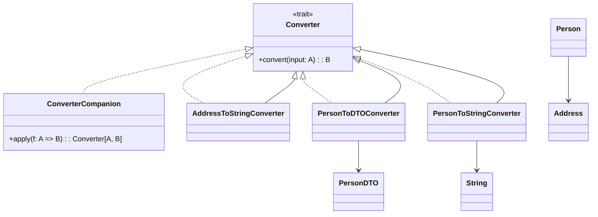

# **Converter Framework**

## Overview

A type-safe, composable framework for converting between complex types in Scala 3. It enables you to define, compose, and reuse generic converters for any types, following the Adapter Pattern.

---

## Tech Stack

- **Language** -> Scala 3.6.3
- **Build Tool** -> sbt 1.10.11
- **Runtime** -> JDK 25
- **Testing** -> ScalaTest 3.2.16

---

## Architecture Diagram


```mermaid
classDiagram
    direction TB
    class Converter {
        <<trait>>
        +convert(input: A): B
    }
    class ConverterCompanion {
        +apply(f: A => B): Converter[A, B]
    }
    Converter <|.. ConverterCompanion
    Converter <|.. AddressToStringConverter
    Converter <|.. PersonToDTOConverter
    Converter <|.. PersonToStringConverter
    class Address
    class Person
    class PersonDTO
    AddressToStringConverter --|> Converter
    PersonToDTOConverter --|> Converter
    PersonToStringConverter --|> Converter
    Person --> Address
    PersonToDTOConverter --> PersonDTO
    PersonToStringConverter --> String
```

---

## Setup Instructions

### 1 - Clone

```bash
git clone https://github.com/rbleggi/tech-pocs.git
cd scala-3/converter-framework
```

### 2 - Build

```bash
sbt compile
```

### 3 - Test

```bash
sbt test
```
