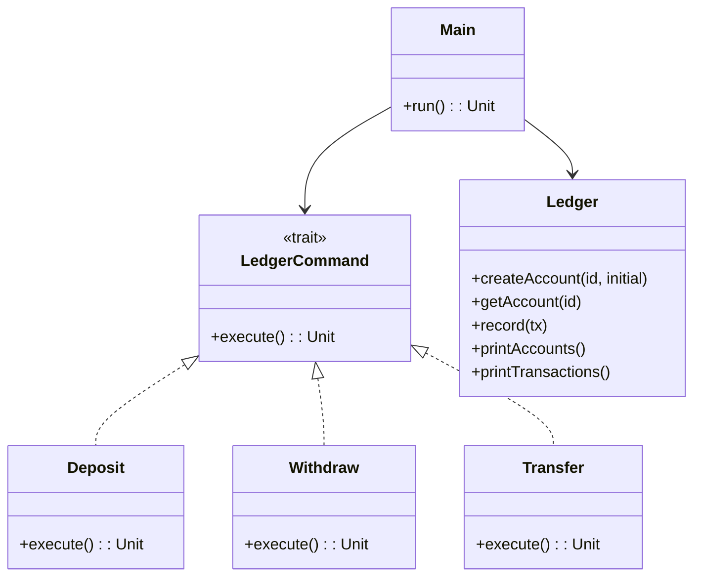

# Core Bank Ledger PoC

## Overview

This project implements a simple Core Bank Ledger using the Command Pattern in Scala. It demonstrates basic banking operations (deposit, withdraw, transfer) with an extensible and testable design, all in a single file for proof-of-concept purposes.

---

## **Tech Stack**

- **Scala 3** → Modern JVM-based language with advanced type safety and functional programming features.
- **SBT** → Scala's official build tool.
- **JDK 21** → Required to run the application.

---

## Features
- **In-memory account and transaction ledger**
- **Command Pattern**: Encapsulates each operation as a command for extensibility
- **Simple CLI PoC**: Run and see account balances and transaction logs
- **Extensible**: Add new operations by implementing the `LedgerCommand` trait

---

## Architecture Diagram



---

## Implementation Details

- The `LedgerCommand` trait defines the interface for all ledger operations.
- Concrete commands (`Deposit`, `Withdraw`, `Transfer`) implement the operation logic.
- The `Ledger` class manages accounts and transaction history in memory.
- The `Main` object creates accounts, executes a sequence of commands, and prints results.
- To add new operations, implement the `LedgerCommand` trait and use it in the main runner.

---

## **Setup Instructions**

### **1️ - Clone the Repository**

```bash
git clone https://github.com/rbleggi/tech-pocs.git
cd scala-3/core-bank-ledger
```

### **2️ - Compile & Run the Application**

```bash
./sbtw compile run
```

### **3️ - Run Tests**

```bash
./sbtw test
```
