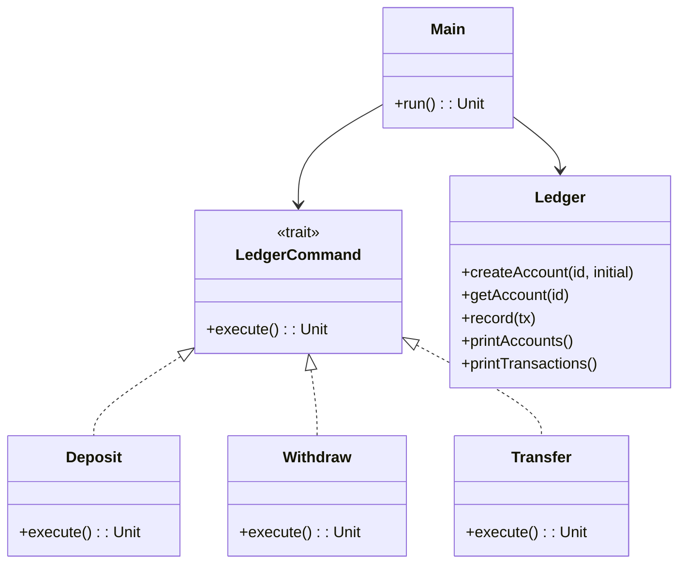

# **Core Bank Ledger**

## Overview

This project implements a simple Core Bank Ledger using the Command Pattern in Scala. It demonstrates basic banking operations (deposit, withdraw, transfer) with an extensible and testable design, all in a single file for proof-of-concept purposes.

---

## Tech Stack

- **Language** -> Scala 3.6.3
- **Build Tool** -> sbt 1.10.11
- **Runtime** -> JDK 25
- **Testing** -> ScalaTest 3.2.16

---

## Architecture Diagram


```mermaid
classDiagram
    direction TB

    class LedgerCommand {
        <<trait>>
        +execute(): Unit
    }

    class Deposit {
        +execute(): Unit
    }
    class Withdraw {
        +execute(): Unit
    }
    class Transfer {
        +execute(): Unit
    }

    class Ledger {
        +createAccount(id, initial)
        +getAccount(id)
        +record(tx)
        +printAccounts()
        +printTransactions()
    }

    class Main {
        +run(): Unit
    }

    LedgerCommand <|.. Deposit
    LedgerCommand <|.. Withdraw
    LedgerCommand <|.. Transfer
    Main --> Ledger
    Main --> LedgerCommand
```

---

## Setup Instructions

### 1 - Clone

```bash
git clone https://github.com/rbleggi/tech-pocs.git
cd scala-3/core-bank-ledger
```

### 2 - Build

```bash
sbt compile
```

### 3 - Test

```bash
sbt test
```
