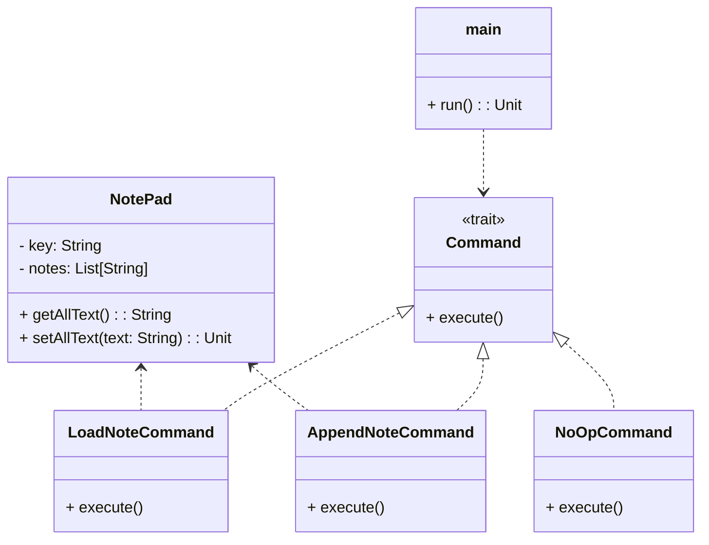

# **NotePad Command App**

## **Overview**

A minimal local clone of dontpad.com. Each URL (e.g., `/mypage`) represents a separate document. When you open a document, all its text is loaded and shown for copying/editing. Any new text you enter is appended after the existing content.

---

## **Tech Stack**

- **Scala 3** → Modern JVM-based language with advanced type safety and functional programming features.
- **SBT** → Scala's official build tool.
- **JDK 21** → Required to run the application.

---

## **Features**

- URL-based documents: Each URL (e.g., `/mypage`) is a separate note.
- Load all text: When you open a document, all its text is loaded and shown.
- Append new text: New input is appended after the existing text.
- Minimal interface: No add/remove/list options—just a single editable note per URL (the URL is used as a key for the note file).
- **Command Pattern**: All main actions (load, append, no-op) are encapsulated as command objects for extensibility.
- The note is loaded and displayed when you open the document, allowing you to copy and continue editing. New text is appended after the existing content.

---

## **Architecture Diagram**



---

## **Command Pattern**

The **Command Pattern** is used to encapsulate each user action (load, append, no-op) as a command object. This provides flexibility, extensibility, and separation of concerns, making it easy to add new actions or modify existing ones without changing the core logic of the application.

---

## **Setup Instructions**

### **1️ - Clone the Repository**

```bash
git clone https://github.com/rbleggi/tech-pocs.git
cd scala-3/dont-pad
```

### **2️ - Compile & Run the Application**

```shell
./sbtw compile run
```

### **3️ - Run Tests**

```shell
./sbtw compile test
```
