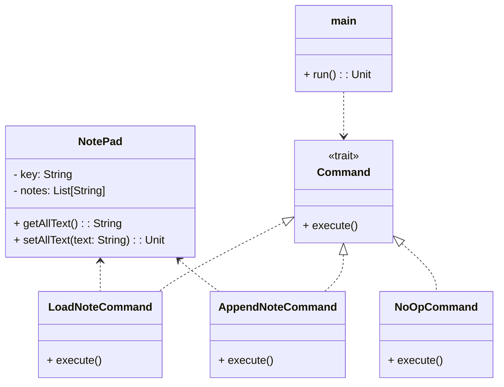

# **NotePad Command App**

## Overview

A minimal local clone of dontpad.com. Each URL (e.g., `/mypage`) represents a separate document. When you open a document, all its text is loaded and shown for copying/editing. Any new text you enter is appended after the existing content.

---

## Tech Stack

- **Language** -> Scala 3.6.3
- **Build Tool** -> sbt 1.10.11
- **Runtime** -> JDK 25
- **Testing** -> ScalaTest 3.2.16

---

## Architecture Diagram


```mermaid
classDiagram
    direction TB
    class NotePad {
        - key: String
        - notes: List[String]
        + getAllText(): String
        + setAllText(text: String): Unit
    }
    class Command {
        <<trait>>
        + execute()
    }
    class LoadNoteCommand {
        + execute()
    }
    class AppendNoteCommand {
        + execute()
    }
    class NoOpCommand {
        + execute()
    }
    NotePad <.. LoadNoteCommand
    NotePad <.. AppendNoteCommand
    Command <|.. LoadNoteCommand
    Command <|.. AppendNoteCommand
    Command <|.. NoOpCommand
    class main {
        + run(): Unit
    }
    main ..> Command
```

---

## Setup Instructions

### 1 - Clone

```bash
git clone https://github.com/rbleggi/tech-pocs.git
cd scala-3/dont-pad
```

### 2 - Build

```bash
sbt compile
```

### 3 - Test

```bash
sbt test
```
