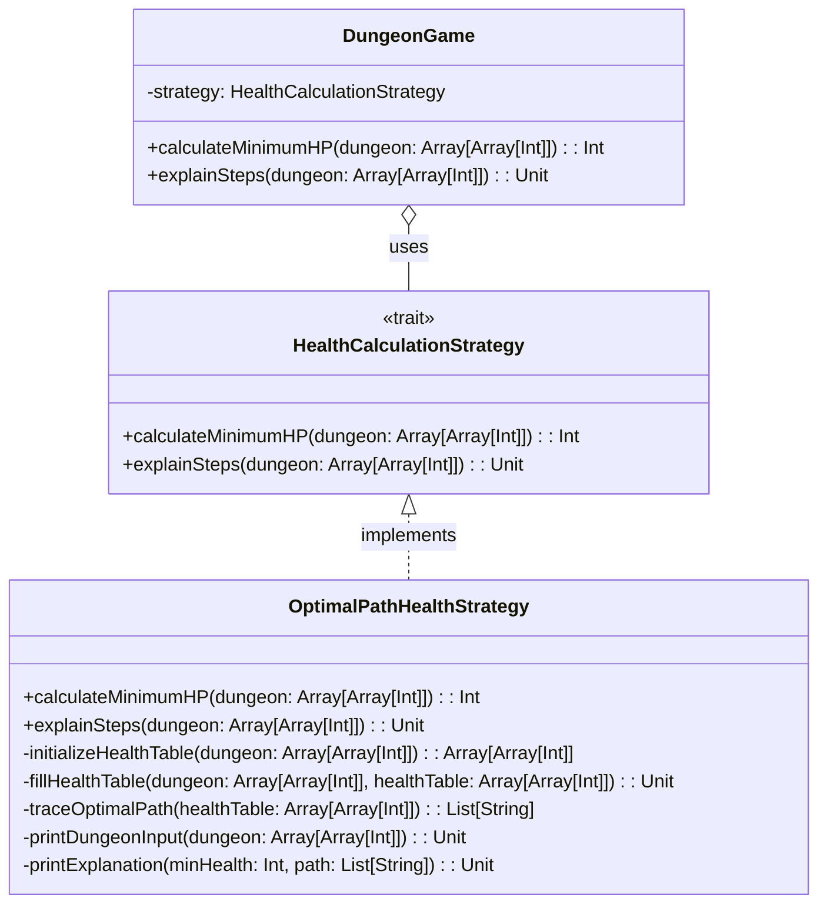

# **Dungeon Game**

## **Overview**

This project implements a **Dungeon Game** where the goal is to calculate the minimum initial health required for a knight to rescue a princess. The solution is designed using the **Strategy Pattern**, making it flexible and extensible for different calculation strategies.

### **Tech Stack**

- **Scala 3** → Modern JVM-based language with functional programming support.
- **SBT** → Scala's official build tool.
- **JDK 21** → Required to run the application.

---

## **Features**

- **Optimal Path Strategy** → Efficiently calculates the minimum health required using a bottom-up tabulation approach.
- **Strategy Pattern** → Encapsulates the calculation logic, allowing easy extension with new strategies.
- **Test Cases** → Includes predefined test cases to validate the solution.

---

## **Architecture Diagram**



---

## **Example Usage**

### **Input Dungeon**

```scala
val dungeon = Array(
  Array(-2, -3, 3),
  Array(-5, -10, 1),
  Array(10, 30, -5)
)
```

### **Output**

```shell
Minimum initial health needed: 7

Dungeon Input:
[-2, -3, 3]
[-5, -10, 1]
[10, 30, -5]

Explanation: The initial health of the knight must be at least 7 if he follows the optimal path: RIGHT -> RIGHT -> DOWN -> DOWN.
```

---

## **Setup Instructions**

### **1️ - Clone the Repository**

```shell
git clone https://github.com/rbleggi/tech-pocs.git
cd scala-3/dungeon-game
```

### **2️ - Compile & Run the Application**

```shell
./sbtw compile run
```

### **3️ - Run Tests**

```shell
./sbtw compile test
```
