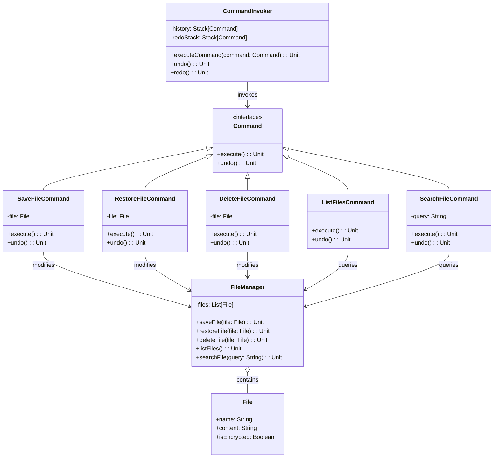

# **FileShare System**

## **Overview**

This project implements a **flexible and maintainable file-sharing system** using the **Command Pattern**. Users can save files, restore files, delete files, list all files, and search for specific files. The system also supports undo and redo functionality for all actions.

### **Tech Stack**

- **Scala 3.6** → Modern JVM-based language with functional programming support.
- **SBT** → Scala's official build tool.
- **JDK 21** → Required to run the application.

---

## **Features**

- **File Management** → Save, restore, delete, list, and search files
- **Action History** → Undo and redo functionality
- **Command Pattern** → Actions are encapsulated as commands for easy extension
- **Encryption** → Files are encrypted for secure storage
- **Immutable Data** → Leverages Scala's immutability for safer code

---

## **Architecture Diagram**



---

## **Command Pattern**

The **Command Pattern** encapsulates requests as objects, allowing:

- Each file management action is implemented as a separate `Command`
- `CommandInvoker` maintains history for undo/redo functionality
- Commands know how to execute and undo themselves
- Easy extension with new commands without modifying existing code
- Clean separation between the invoker and the receiver

---

## **Setup Instructions**

### **1️ - Clone the Repository**

```shell
git clone https://github.com/rbleggi/tech-pocs.git
cd scala-3/file-share-system
```

### **2️ - Compile & Run the Application**

```shell
./sbtw compile run
```

### **3️ - Run Tests**

```shell
./sbtw compile test
```
