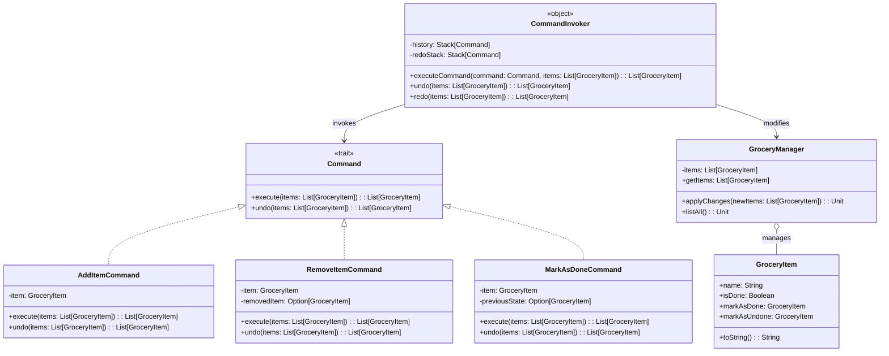

# **Grocery TODO List**

## **Overview**

This project implements a **flexible and maintainable grocery TODO list system** using the **Command Pattern**. Users can add items, remove items, mark items as done, undo actions, redo actions, and list all items - all through a simple, unified interface.

---

## **Tech Stack**

- **Scala 3** → Modern JVM-based language with advanced type safety and functional programming features.
- **SBT** → Scala's official build tool.
- **JDK 21** → Required to run the application.

---

## **Features**

- **Comprehensive Grocery Management** → Add, remove, and mark items as done.
- **Action History** → Undo and redo functionality for better control.
- **Command Pattern** → Actions are encapsulated as commands for easy extension and maintainability.
- **No Boilerplate** → Clean, straightforward implementation.
- **Immutable Data** → Leverages Scala's immutability for safer and more predictable code.

---

## **Architecture Diagram**



---

## **Command Pattern**

The **Command Pattern** encapsulates requests as objects, allowing:

- Each grocery list action to be implemented as a separate `Command`.
- `CommandInvoker` to maintain history for undo/redo functionality.
- Commands to know how to execute and undo themselves, ensuring encapsulation.
- Easy extension with new commands without modifying existing code, adhering to the Open/Closed Principle.
- Clean separation between the invoker (`CommandInvoker`) and the receiver (`GroceryManager`), improving modularity and testability.

---

## **Setup Instructions**

### **1️ - Clone the Repository**

```shell
git clone https://github.com/rbleggi/tech-pocs.git
cd scala-3/grocery-todo-list
```

### **2️ - Compile & Run the Application**

```shell
./sbtw compile run
```

### **3️ - Run Tests**

```shell
./sbtw compile test
```
