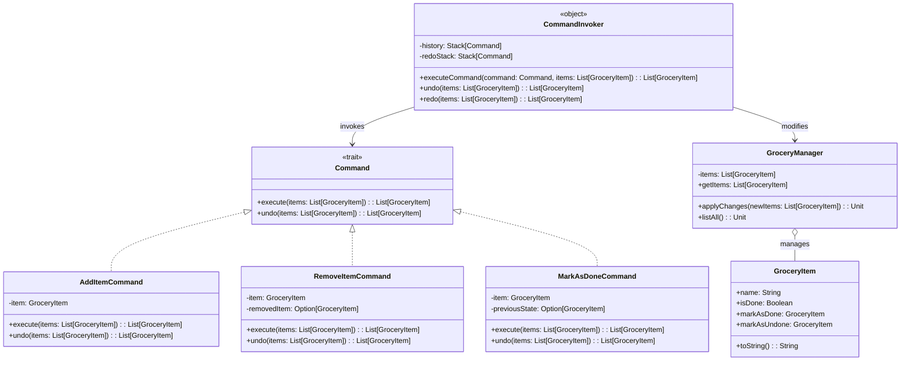

# **Grocery TODO List**

## Overview

This project implements a flexible and maintainable grocery TODO list system using the Command Pattern. Users can add items, remove items, mark items as done, undo actions, redo actions, and list all items through a simple, unified interface.

---

## Tech Stack

- **Language** -> Scala 3.6.3
- **Build Tool** -> sbt 1.10.11
- **Runtime** -> JDK 25
- **Testing** -> ScalaTest 3.2.16

---

## Architecture Diagram


```mermaid
classDiagram
    direction TB

    class Command {
        <<trait>>
        +execute(items: List[GroceryItem]): List[GroceryItem]
        +undo(items: List[GroceryItem]): List[GroceryItem]
    }

    class AddItemCommand {
        -item: GroceryItem
        +execute(items: List[GroceryItem]): List[GroceryItem]
        +undo(items: List[GroceryItem]): List[GroceryItem]
    }

    class RemoveItemCommand {
        -item: GroceryItem
        -removedItem: Option[GroceryItem]
        +execute(items: List[GroceryItem]): List[GroceryItem]
        +undo(items: List[GroceryItem]): List[GroceryItem]
    }

    class MarkAsDoneCommand {
        -item: GroceryItem
        -previousState: Option[GroceryItem]
        +execute(items: List[GroceryItem]): List[GroceryItem]
        +undo(items: List[GroceryItem]): List[GroceryItem]
    }

    class GroceryItem {
        +name: String
        +isDone: Boolean
        +markAsDone: GroceryItem
        +markAsUndone: GroceryItem
        +toString(): String
    }

    class GroceryManager {
        -items: List[GroceryItem]
        +getItems: List[GroceryItem]
        +applyChanges(newItems: List[GroceryItem]): Unit
        +listAll(): Unit
    }

    class CommandInvoker {
        <<object>>
        -history: Stack[Command]
        -redoStack: Stack[Command]
        +executeCommand(command: Command, items: List[GroceryItem]): List[GroceryItem]
        +undo(items: List[GroceryItem]): List[GroceryItem]
        +redo(items: List[GroceryItem]): List[GroceryItem]
    }

    Command <|.. AddItemCommand
    Command <|.. RemoveItemCommand
    Command <|.. MarkAsDoneCommand
    CommandInvoker --> Command: invokes
    GroceryManager o-- GroceryItem: manages
    CommandInvoker --> GroceryManager: modifies
```

---

## Setup Instructions

### 1 - Clone

```bash
git clone https://github.com/rbleggi/tech-pocs.git
cd scala-3/grocery-todo-list
```

### 2 - Build

```bash
sbt compile
```

### 3 - Test

```bash
sbt test
```
