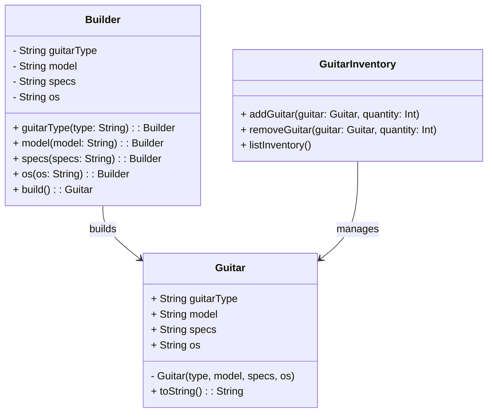

# **Guitar Builder System**

## **Overview**

This project implements a **custom guitar builder system** that allows users to flexibly create personalized guitars by
specifying attributes such as **type, model, specifications, and operating system (OS)**. It also includes an *
*inventory management system**, tracking available guitars and their quantities.

The project utilizes the **Builder Pattern** to streamline guitar creation with flexibility and readability and uses a *
*Singleton Pattern** for centralized, consistent inventory management.

### **Tech Stack**

- **Scala 3.6** → Modern JVM-based language with functional programming support.
- **SBT** → Scala's build tool for managing dependencies and compiling code.
- **JDK 21** → Required for running the application.

---

## **Features**

- **Flexible Guitar Creation** → Users specify guitar attributes dynamically.  
- **Inventory Management** → Tracks available guitars and stock levels.  
- **Builder Pattern** → Simplifies the creation of guitars through a fluent interface.  
- **Singleton Inventory** → Ensures centralized and consistent stock control.  
- **Scalability** → Easily extendable to accommodate additional guitar attributes.

---

## **Class Diagram**

The following diagram illustrates the updated structure using the **Builder Pattern**:



---

## **Builder Pattern**

The **Builder Pattern** simplifies creating guitars with various attributes without needing separate subclasses for each
guitar type. It provides a fluent API that:

1. **Allows chaining methods** to set guitar attributes (`type`, `model`, `specs`, `os`).
2. **Encapsulates construction logic** within the `GuitarBuilder`, separating it from the `Guitar` class itself.
3. **Produces immutable `Guitar` instances** after calling the `build()` method.

---

## **Singleton Pattern**

The **Singleton Pattern** ensures a single, consistent inventory system (`GuitarInventory`) is available throughout the
application's lifecycle. This prevents inconsistencies and duplicate inventories, ensuring that all operations (add,
remove, list) interact with the same shared data source.

---

## **Setup Instructions**

### **1️ - Clone the Repository**
```shell
git clone https://github.com/rbleggi/tech-pocs.git
cd scala-3/guitar-builder
```

### **2️ - Compile & Run the Application**
```shell
./sbtw compile run
```

### **3️ - Run Tests**
```shell
./sbtw compile test
```