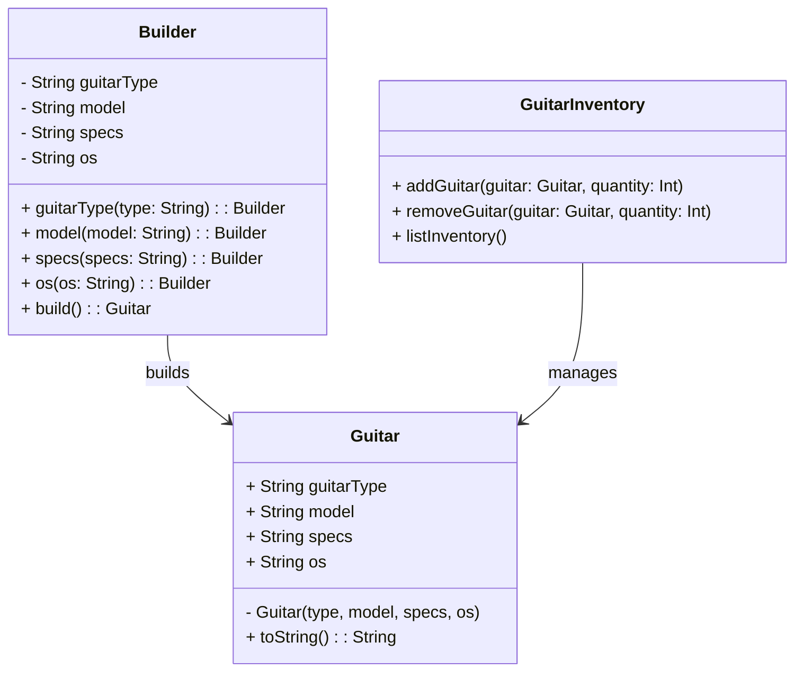

# **Guitar Builder**

## Overview

This project implements a custom guitar builder system that allows users to flexibly create personalized guitars by specifying attributes such as type, model, specifications, and operating system. It also includes an inventory management system tracking available guitars and their quantities. The project utilizes the Builder Pattern for guitar creation and the Singleton Pattern for centralized inventory management.

---

## Tech Stack

- **Language** -> Scala 3.6.3
- **Build Tool** -> sbt 1.10.11
- **Runtime** -> JDK 25
- **Testing** -> ScalaTest 3.2.16

---

## Architecture Diagram


```mermaid
classDiagram
    direction TB

    class Guitar {
        - Guitar(type, model, specs, os)
        + String guitarType
        + String model
        + String specs
        + String os
        + toString(): String
    }

    class Builder {
        - String guitarType
        - String model
        - String specs
        - String os
        + guitarType(type: String): Builder
        + model(model: String): Builder
        + specs(specs: String): Builder
        + os(os: String): Builder
        + build(): Guitar
    }

    class GuitarInventory {
        + addGuitar(guitar: Guitar, quantity: Int)
        + removeGuitar(guitar: Guitar, quantity: Int)
        + listInventory()
    }

    Builder --> Guitar: builds
    GuitarInventory --> Guitar: manages
```

---

## Setup Instructions

### 1 - Clone

```bash
git clone https://github.com/rbleggi/tech-pocs.git
cd scala-3/guitar-factory
```

### 2 - Build

```bash
sbt compile
```

### 3 - Test

```bash
sbt test
```
