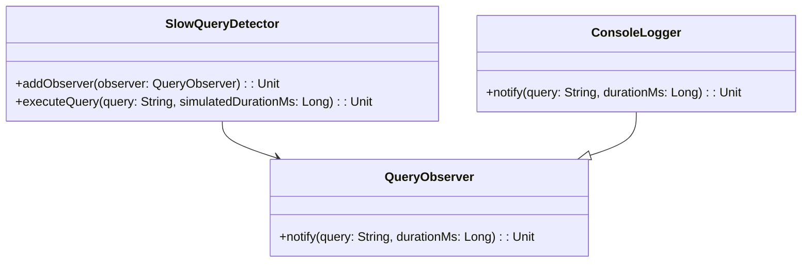

# **Hibernate Slow Query Detector**

## **Overview**

This project demonstrates a Hibernate Slow Query Detector in Scala. The solution uses the Observer Pattern to monitor query execution times and notify observers when a query exceeds a configurable threshold. All logic is contained in a single file.

---

## **Tech Stack**

- **Scala 3** → Modern JVM-based language with advanced type safety and functional programming features.
- **SBT** → Scala's official build tool.
- **JDK 21** → Required to run the application.

---

## **Features**

- **Slow Query Detection** → Notifies when a query exceeds the threshold.
- **Observer Pattern** → Extensible design for monitoring and notification.
- **Single File Implementation** → All logic is contained in one file for simplicity.

---

## **Architecture Diagram**



---

## **Implementation Details**

- The solution uses the Observer Pattern: observers are notified when a query is slow.
- The main entry point is `@main def run(): Unit =`, which demonstrates slow query detection.
- All logic is in a single Scala file, with no comments.
- To test, run the application and observe the output for slow queries.

---

## **Setup Instructions**

### **1️ - Clone the Repository**

```bash
git clone https://github.com/rbleggi/tech-pocs.git
cd scala-3/hibernate-slow-query-detector
```

### **2️ - Compile & Run the Application**

```bash
./sbtw compile run
```

### **3️ - Run Tests**

```bash
./sbtw test
```
