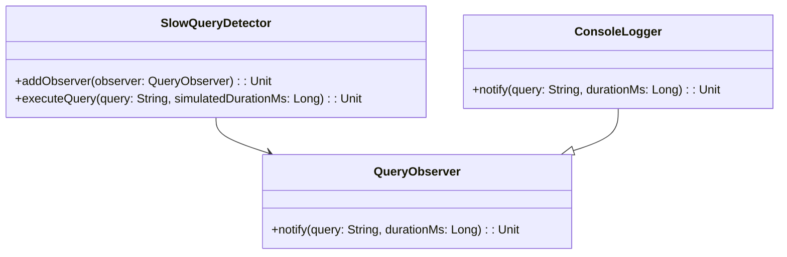

# **Hibernate Slow Query Detector**

## Overview

This project demonstrates a Hibernate Slow Query Detector in Scala. The solution uses the Observer Pattern to monitor query execution times and notify observers when a query exceeds a configurable threshold. All logic is contained in a single file.

---

## Tech Stack

- **Language** -> Scala 3.6.3
- **Build Tool** -> sbt 1.10.11
- **Runtime** -> JDK 25
- **Testing** -> ScalaTest 3.2.16

---

## Architecture Diagram


```mermaid
classDiagram
    direction TB

    class QueryObserver {
        +notify(query: String, durationMs: Long): Unit
    }
    class SlowQueryDetector {
        +addObserver(observer: QueryObserver): Unit
        +executeQuery(query: String, simulatedDurationMs: Long): Unit
    }
    class ConsoleLogger {
        +notify(query: String, durationMs: Long): Unit
    }

    SlowQueryDetector --> QueryObserver
    ConsoleLogger --|> QueryObserver
```

---

## Setup Instructions

### 1 - Clone

```bash
git clone https://github.com/rbleggi/tech-pocs.git
cd scala-3/hibernate-slow-query-detector
```

### 2 - Build

```bash
sbt compile
```

### 3 - Test

```bash
sbt test
```
