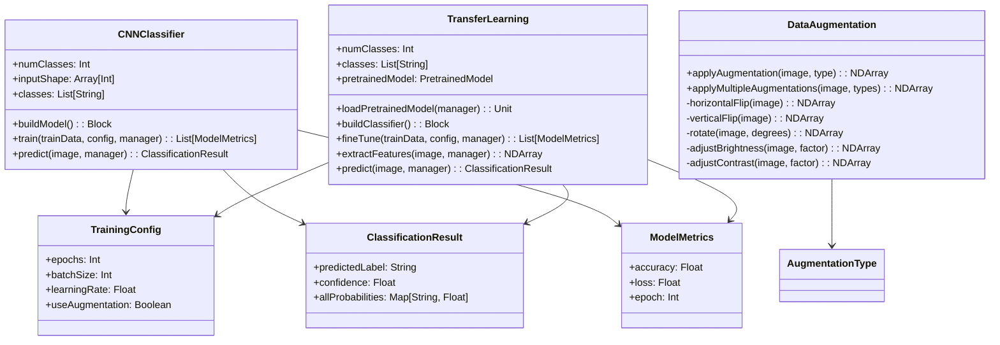

# Image Classification System

A comprehensive image classification system using Convolutional Neural Networks (CNNs) with data augmentation and transfer learning capabilities.

## Overview

This POC demonstrates a complete image classification pipeline including:
- Custom CNN architecture for image classification
- Data augmentation techniques to improve model generalization
- Transfer learning using pretrained models (ResNet50, MobileNetV2, SqueezeNet)
- Training and evaluation workflows
- Prediction with confidence scores

## Tech Stack

- Scala 3.6.3
- SBT 1.10.11
- JDK 25
- DJL (Deep Java Library) 0.30.0
- PyTorch Engine
- ScalaTest 3.2.16

## Features

### 1. CNN Classifier
- 3-layer convolutional architecture (32, 64, 128 filters)
- MaxPooling layers for dimensionality reduction
- Fully connected layers with dropout (0.5)
- Softmax output for multi-class classification
- Configurable input shape and number of classes

### 2. Data Augmentation
- Horizontal flip
- Vertical flip
- Random rotation
- Brightness adjustment
- Contrast adjustment
- Random crop
- Zoom transformation
- Support for multiple augmentations pipeline

### 3. Transfer Learning
- Pretrained model support:
  - ResNet50 (2048 features)
  - MobileNetV2 (1280 features)
  - SqueezeNet (512 features)
- Feature extraction from pretrained models
- Fine-tuning with layer freezing
- Custom classifier head
- Flexible training configurations

## Architecture



## Implementation Details

### CNN Architecture

The custom CNN classifier uses a proven architecture pattern:

1. **Convolutional Layers**: Three conv layers with increasing filter counts (32 → 64 → 128)
2. **Pooling**: MaxPooling after each conv layer for spatial reduction
3. **Fully Connected**: Dense layers (256 units) with ReLU activation
4. **Regularization**: Dropout (0.5) to prevent overfitting
5. **Output**: Softmax layer for multi-class probabilities

### Data Augmentation Pipeline

Augmentation techniques are applied to increase training data diversity:

- Geometric transformations (flip, rotation, crop, zoom)
- Color space adjustments (brightness, contrast)
- Random parameter selection for variation
- Pipeline support for multiple sequential augmentations

### Transfer Learning Workflow

1. Load pretrained model (ResNet50, MobileNetV2, or SqueezeNet)
2. Extract features using pretrained backbone
3. Freeze feature extractor layers (optional)
4. Train custom classifier on extracted features
5. Option to unfreeze and fine-tune entire network

## Setup

```bash
git clone <repository-url>
cd scala-3/image-classification
```

## Usage

### Compile and Run

```bash
./sbtw compile run
```

### Run Tests

```bash
./sbtw test
```

### Single Test

```bash
./sbtw "testOnly *ImageClassificationSpec"
```

## Example Output

```
=== Image Classification System with CNNs ===

1. CNN Classifier Demo
--------------------------------------------------
✓ Initialized CNN model with 3 classes
✓ Input shape: [3, 64, 64] (RGB 64x64 images)
✓ Architecture: 3 Conv layers (32, 64, 128 filters) + 2 FC layers

✓ Training on 10 synthetic samples...
  Epoch 0: Accuracy=0.6000, Loss=1.0234
  Epoch 1: Accuracy=0.7000, Loss=0.8123

✓ Prediction: cat (73% confidence)
  All probabilities:
    cat: 73.45%
    dog: 18.32%
    bird: 8.23%

2. Data Augmentation Demo
--------------------------------------------------
✓ Original image shape: [3, 64, 64]

✓ Applying augmentations:
  - HorizontalFlip: shape=[3, 64, 64]
  - Rotation: shape=[3, 64, 64]
  - Brightness: shape=[3, 64, 64]
  - Contrast: shape=[3, 64, 64]

✓ Multiple augmentations applied: 4 transformations
  Final shape: [3, 64, 64]

3. Transfer Learning Demo
--------------------------------------------------
✓ Initialized transfer learning with ResNet50
✓ Number of classes: 3
✓ Feature extractor: ResNet50 (2048 features)
✓ Classifier: 2-layer FC network

✓ Transfer learning workflow:
  1. Load pretrained model (ResNet50)
  2. Freeze feature extractor layers
  3. Train only the classifier head
  4. Optional: Unfreeze and fine-tune all layers

✓ Available pretrained models:
  - ResNet50: 2048 features
  - MobileNetV2: 1280 features
  - SqueezeNet: 512 features
```

## Key Components

### Models (`model/Models.scala`)
- `ImageData`: Image path with label and category
- `ClassificationResult`: Prediction with confidence scores
- `TrainingConfig`: Training hyperparameters
- `ModelMetrics`: Training metrics per epoch
- `AugmentationType`: Enumeration of augmentation types
- `PretrainedModel`: Available pretrained models

### CNN Classifier (`core/CNNClassifier.scala`)
- Custom CNN architecture builder
- Training loop with metrics tracking
- Prediction with confidence scores
- Model initialization and management

### Data Augmentation (`augmentation/DataAugmentation.scala`)
- Individual augmentation transformations
- Multi-augmentation pipeline
- Configurable parameters (rotation angle, brightness factor, etc.)

### Transfer Learning (`transfer/TransferLearning.scala`)
- Pretrained model loading
- Feature extraction
- Custom classifier builder
- Fine-tuning with layer freezing

## References

- [DJL Documentation](https://djl.ai/)
- [PyTorch Documentation](https://pytorch.org/)
- [CNN Architectures](https://cs231n.github.io/convolutional-networks/)
- [Transfer Learning Guide](https://cs231n.github.io/transfer-learning/)
