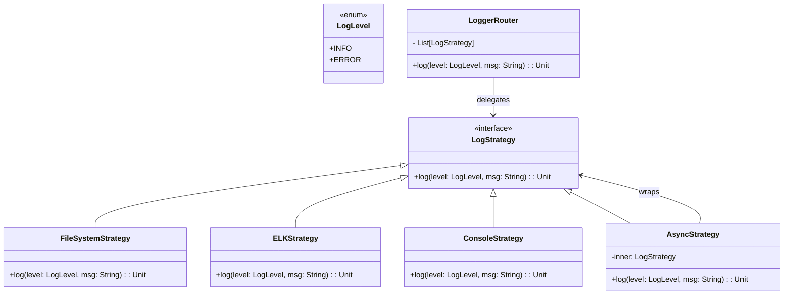

# **Logger Router System**

## **Overview**

This project implements a **lightweight and flexible log routing system** using the **Strategy Pattern**. Logs can be sent to multiple destinations like **FileSystem**, **ELK**, or **Console**, with support for **synchronous or asynchronous delivery** — all through a simple, unified interface.

### **Tech Stack**
- **Scala 3.6** → Modern functional/object-oriented language on the JVM.
- **SBT** → Scala's official build tool.
- **JDK 21** → Required to run the application.

---

## **Features**
- **Multi-Destination Logging** → File, ELK, and Console supported  
- **Sync or Async per Strategy** → Configure independently for each target  
- **Strategy Pattern** → Logging logic is cleanly separated and reusable  
- **No Boilerplate** → No builder or wrapper classes required  
- **Minimal API** → Log directly via `.log(LogLevel, message)`

---

## **Class Diagram**



---

## **Strategy Pattern**

The **Strategy Pattern** allows each logging destination to encapsulate its own behavior. Instead of hardcoding log handling:

1. Each destination implements `LogStrategy`.
2. The router (`LoggerRouter`) delegates the log call to all configured strategies.
3. `AsyncStrategy` wraps any existing strategy to make it non-blocking.
4. No wrapper classes or builders are needed — just build a list of strategies.

---

## **Usage Example**

```scala
import scala.concurrent.ExecutionContext.Implicits.global

val strategies: List[LogStrategy] = List(
  FileSystemStrategy("app.log"),
  AsyncStrategy(ELKStrategy("http://localhost:9200"), global),
  ConsoleStrategy()
)

val logger = LoggerRouter(strategies)

logger.log(LogLevel.INFO, "User login successful")
logger.log(LogLevel.ERROR, "Database connection failed")
```

---

## **Setup Instructions**

### **1️ - Clone the Repository**
```bash
git clone https://github.tlcinternal.com/rbleggi/tech-pocs.git
cd scala-3.6/logger-builder-router-system
```

### **2️ - Compile & Run the Application**
```bash
./sbt compile run
```

### **3️ - Run Tests**
```bash
./sbt test
```