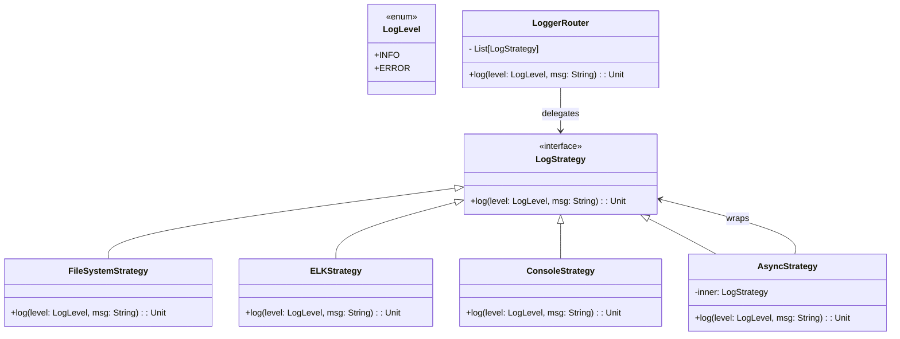

# **Logger Router**

## Overview

This project implements a lightweight and flexible log routing system using the Strategy Pattern. Logs can be sent to multiple destinations like FileSystem, ELK, or Console, with support for synchronous or asynchronous delivery through a simple, unified interface.

---

## Tech Stack

- **Language** -> Scala 3.6.3
- **Build Tool** -> sbt 1.10.11
- **Runtime** -> JDK 25
- **Testing** -> ScalaTest 3.2.16

---

## Architecture Diagram


```mermaid
classDiagram
    direction TB

    class LogLevel {
        <<enum>>
        +INFO
        +ERROR
    }

    class LogStrategy {
        <<interface>>
        +log(level: LogLevel, msg: String): Unit
    }

    class FileSystemStrategy {
        +log(level: LogLevel, msg: String): Unit
    }

    class ELKStrategy {
        +log(level: LogLevel, msg: String): Unit
    }

    class ConsoleStrategy {
        +log(level: LogLevel, msg: String): Unit
    }

    class AsyncStrategy {
        -inner: LogStrategy
        +log(level: LogLevel, msg: String): Unit
    }

    class LoggerRouter {
        - List[LogStrategy]
        +log(level: LogLevel, msg: String): Unit
    }

    LogStrategy <|-- FileSystemStrategy
    LogStrategy <|-- ELKStrategy
    LogStrategy <|-- ConsoleStrategy
    LogStrategy <|-- AsyncStrategy
    AsyncStrategy --> LogStrategy: wraps
    LoggerRouter --> LogStrategy: delegates
```

---

## Setup Instructions

### 1 - Clone

```bash
git clone https://github.com/rbleggi/tech-pocs.git
cd scala-3/logger-router
```

### 2 - Build

```bash
sbt compile
```

### 3 - Test

```bash
sbt test
```
