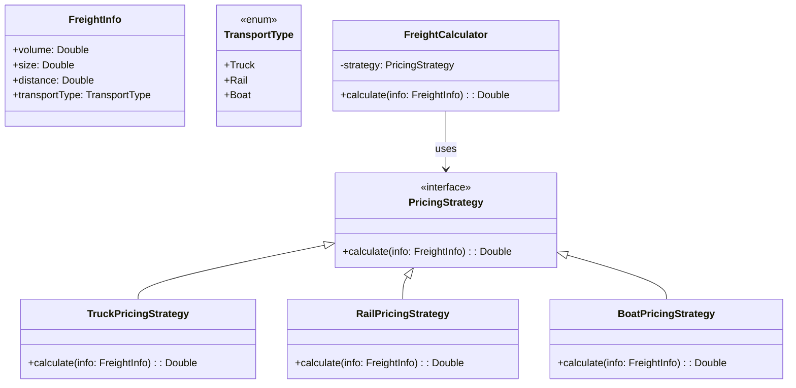

# **Logistic Pricing**

## Overview

This project implements a modular and extensible freight pricing system using the Strategy Pattern. Freight costs are dynamically calculated based on factors like volume, size, and transport type such as Truck, Rail, or Boat, with prices subject to real-time variability.

---

## Tech Stack

- **Language** -> Scala 3.6.3
- **Build Tool** -> sbt 1.10.11
- **Runtime** -> JDK 25
- **Testing** -> ScalaTest 3.2.16

---

## Architecture Diagram



---

## Setup Instructions

### 1 - Clone

```bash
git clone https://github.com/rbleggi/tech-pocs.git
cd scala-3/logistic-pricing
```

### 2 - Build

```bash
sbt compile
```

### 3 - Test

```bash
sbt test
```
