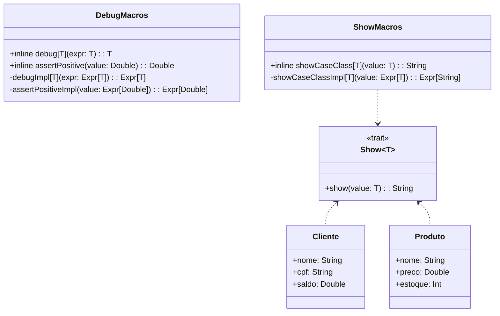

# **Scala 3 Macros**

## **Overview**

This project demonstrates Scala 3's new macro system using inline definitions and quoted expressions. Macros enable compile-time metaprogramming for debugging, validation, and code generation. The example includes a debug macro for logging expressions and an assertion macro for validating positive values.

---

## **Tech Stack**

- **Scala 3.6.3** → Modern JVM language with advanced type safety and functional programming.
- **SBT 1.10.11** → Scala build tool.
- **JDK 25** → Java runtime environment.
- **ScalaTest 3.2.16** → Testing framework.

---

## **Architecture Diagram**



---

## **Setup Instructions**

### 1 - Clone the Repository

```bash
git clone https://github.com/rbleggi/tech-pocs.git
cd scala-3/macros
```

### 2 - Compile & Run the Application

```bash
sbt compile run
```

### 3 - Run Tests

```bash
sbt test
```
