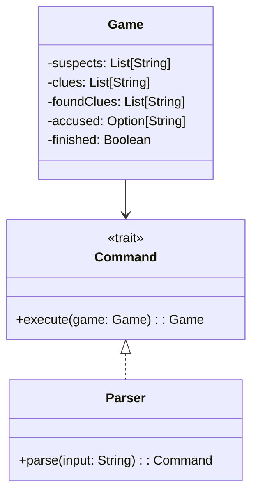

# **Murder Mystery Game**

## Overview

This project implements a simple terminal-based Murder Mystery Game in Scala. The player interacts via commands to find clues and accuse suspects. The solution uses the Command Pattern to handle user actions and game logic.

---

## Tech Stack

- **Language** -> Scala 3.6.3
- **Build Tool** -> sbt 1.10.11
- **Runtime** -> JDK 25
- **Testing** -> ScalaTest 3.2.16

---

## Architecture Diagram


```mermaid
classDiagram
    direction TB

    class Command {
        <<trait>>
        +execute(game: Game): Game
    }

    class Game {
        -suspects: List[String]
        -clues: List[String]
        -foundClues: List[String]
        -accused: Option[String]
        -finished: Boolean
    }

    class Parser {
        +parse(input: String): Command
    }

    Command <|.. Parser
    Game --> Command
```

---

## Setup Instructions

### 1 - Clone

```bash
git clone https://github.com/rbleggi/tech-pocs.git
cd scala-3/murder-mistery-game
```

### 2 - Build

```bash
sbt compile
```

### 3 - Test

```bash
sbt test
```
