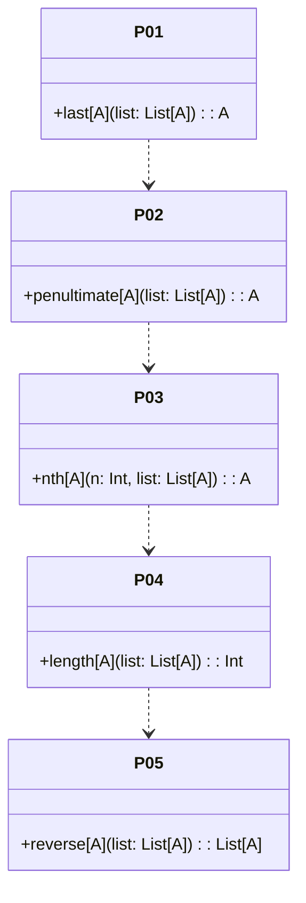

# **Ninety-Nine Scala Problems**

## Overview

Solutions to the classic 99 Scala Problems, a set of exercises designed to improve proficiency with Scala and functional programming. Each problem is implemented in its own file using idiomatic Scala 3 style.

---

## Tech Stack

- **Language** -> Scala 3
- **Build Tool** -> sbt
- **Testing** -> ScalaTest 3.2.16
- **JDK** -> 25

---

## Architecture Diagram



---

## Setup Instructions

### 1 - Clone

```bash
git clone https://github.com/rbleggi/tech-pocs.git
cd scala-3/ninety-nine
```

### 2 - Build

```bash
sbt compile
```

### 3 - Test

```bash
sbt test
```
