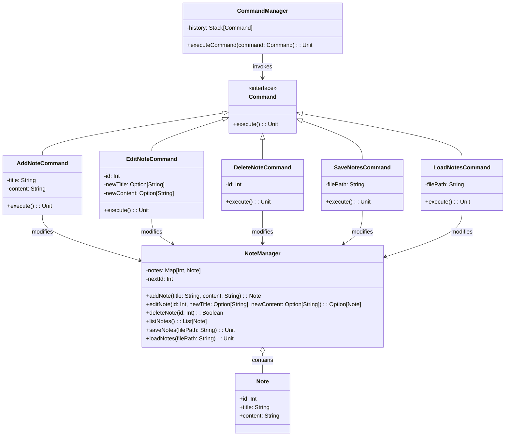

# **Note Taking System**

## **Overview**

This project implements a **flexible and maintainable note-taking system** using the **Command Pattern**. Users can add, edit, delete, save, and load notes. The system is designed to be extensible and supports action history for potential undo/redo functionality.

---

## **Tech Stack**

- **Scala 3** → Modern JVM-based language with advanced type safety and functional programming features.
- **SBT** → Scala's official build tool.
- **JDK 21** → Required to run the application.

---

## **Features**

- **Note Management** → Add, edit, delete, save, and load notes
- **Command Pattern** → Actions are encapsulated as commands for easy extension
- **Action History** → Commands are stored in a stack for potential undo/redo functionality
- **File Persistence** → Notes can be saved to and loaded from a file

---

## **Architecture Diagram**



---

## **Command Pattern**

The **Command Pattern** encapsulates requests as objects, allowing:

- Each note management action is implemented as a separate `Command`
- `CommandManager` maintains a history of executed commands for potential undo/redo functionality
- Commands know how to execute themselves
- Easy extension with new commands without modifying existing code
- Clean separation between the invoker (`CommandManager`) and the receiver (`NoteManager`)

---

## **Setup Instructions**

### **1️ - Clone the Repository**

```shell
git clone https://github.com/rbleggi/tech-pocs.git
cd scala-3/note-taking
```

### **2️ - Compile & Run the Application**

```shell
./sbtw compile run
```

### **3️ - Run Tests**

```shell
./sbtw compile test
```
