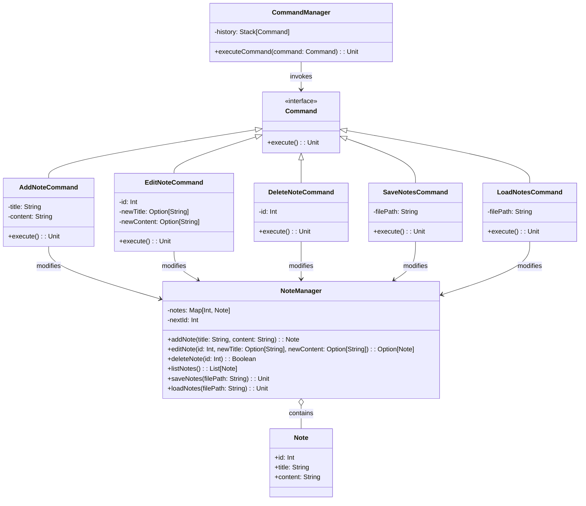

# **Note Taking System**

## Overview

This project implements a flexible and maintainable note-taking system using the Command Pattern. Users can add, edit, delete, save, and load notes. The system is designed to be extensible and supports action history for potential undo/redo functionality.

---

## Tech Stack

- **Language** -> Scala 3.6.3
- **Build Tool** -> sbt 1.10.11
- **Runtime** -> JDK 25
- **Testing** -> ScalaTest 3.2.16

---

## Architecture Diagram


```mermaid
classDiagram
    direction TB

    class Command {
        <<interface>>
        +execute(): Unit
    }

    class AddNoteCommand {
        -title: String
        -content: String
        +execute(): Unit
    }

    class EditNoteCommand {
        -id: Int
        -newTitle: Option[String]
        -newContent: Option[String]
        +execute(): Unit
    }

    class DeleteNoteCommand {
        -id: Int
        +execute(): Unit
    }

    class SaveNotesCommand {
        -filePath: String
        +execute(): Unit
    }

    class LoadNotesCommand {
        -filePath: String
        +execute(): Unit
    }

    class Note {
        +id: Int
        +title: String
        +content: String
    }

    class NoteManager {
        -notes: Map[Int, Note]
        -nextId: Int
        +addNote(title: String, content: String): Note
        +editNote(id: Int, newTitle: Option[String], newContent: Option[String]): Option[Note]
        +deleteNote(id: Int): Boolean
        +listNotes(): List[Note]
        +saveNotes(filePath: String): Unit
        +loadNotes(filePath: String): Unit
    }

    class CommandManager {
        -history: Stack[Command]
        +executeCommand(command: Command): Unit
    }

    Command <|-- AddNoteCommand
    Command <|-- EditNoteCommand
    Command <|-- DeleteNoteCommand
    Command <|-- SaveNotesCommand
    Command <|-- LoadNotesCommand
    AddNoteCommand --> NoteManager: modifies
    EditNoteCommand --> NoteManager: modifies
    DeleteNoteCommand --> NoteManager: modifies
    SaveNotesCommand --> NoteManager: modifies
    LoadNotesCommand --> NoteManager: modifies
    CommandManager --> Command: invokes
    NoteManager o-- Note: contains
```

---

## Setup Instructions

### 1 - Clone

```bash
git clone https://github.com/rbleggi/tech-pocs.git
cd scala-3/note-taking
```

### 2 - Build

```bash
sbt compile
```

### 3 - Test

```bash
sbt test
```
