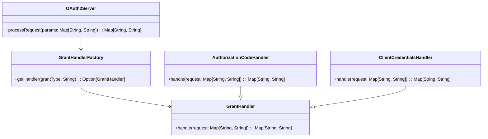

# **OAuth 2.0 Server PoC**

## **Overview**

This project demonstrates a minimal OAuth 2.0 Server in Scala. The solution uses the Factory Pattern to handle extensible grant types, allowing easy addition of new OAuth 2.0 flows. All logic is contained in a single file.

---

## **Tech Stack**

- **Scala 3** → Modern JVM-based language with advanced type safety and functional programming features.
- **SBT** → Scala's official build tool.
- **JDK 21** → Required to run the application.

---

## **Features**

- **OAuth 2.0 Grant Handling** → Supports Authorization Code and Client Credentials grants.
- **Factory Pattern** → Extensible design for grant type handling.
- **Single File Implementation** → All logic is contained in one file for simplicity.

---

## **Architecture Diagram**



---

## **Implementation Details**

- The solution uses the Factory Pattern: the factory returns the correct handler for each grant type.
- The main entry point is `@main def run(): Unit =`, which demonstrates grant handling.
- All logic is in a single Scala file, with no comments.
- To test, run the application and observe the output for each grant type.

---

## **Setup Instructions**

### **1️ - Clone the Repository**

```bash
git clone https://github.com/rbleggi/tech-pocs.git
cd scala-3/oauth2
```

### **2️ - Compile & Run the Application**

```bash
./sbtw compile run
```

### **3️ - Run Tests**

```bash
./sbtw test
```
