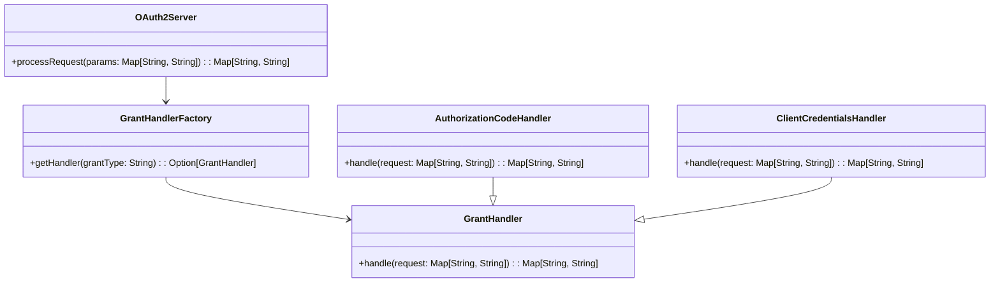

# **OAuth 2.0 Server**

## Overview

This project demonstrates a minimal OAuth 2.0 Server in Scala. The solution uses the Factory Pattern to handle extensible grant types, allowing easy addition of new OAuth 2.0 flows. All logic is contained in a single file.

---

## Tech Stack

- **Language** -> Scala 3.6.3
- **Build Tool** -> sbt 1.10.11
- **Runtime** -> JDK 25
- **Testing** -> ScalaTest 3.2.16

---

## Architecture Diagram


```mermaid
classDiagram
    direction TB

    class GrantHandler {
        +handle(request: Map[String, String]): Map[String, String]
    }
    class AuthorizationCodeHandler {
        +handle(request: Map[String, String]): Map[String, String]
    }
    class ClientCredentialsHandler {
        +handle(request: Map[String, String]): Map[String, String]
    }
    class GrantHandlerFactory {
        +getHandler(grantType: String): Option[GrantHandler]
    }
    class OAuth2Server {
        +processRequest(params: Map[String, String]): Map[String, String]
    }

    GrantHandlerFactory --> GrantHandler
    AuthorizationCodeHandler --|> GrantHandler
    ClientCredentialsHandler --|> GrantHandler
    OAuth2Server --> GrantHandlerFactory
```

---

## Setup Instructions

### 1 - Clone

```bash
git clone https://github.com/rbleggi/tech-pocs.git
cd scala-3/oauth2
```

### 2 - Build

```bash
sbt compile
```

### 3 - Test

```bash
sbt test
```
