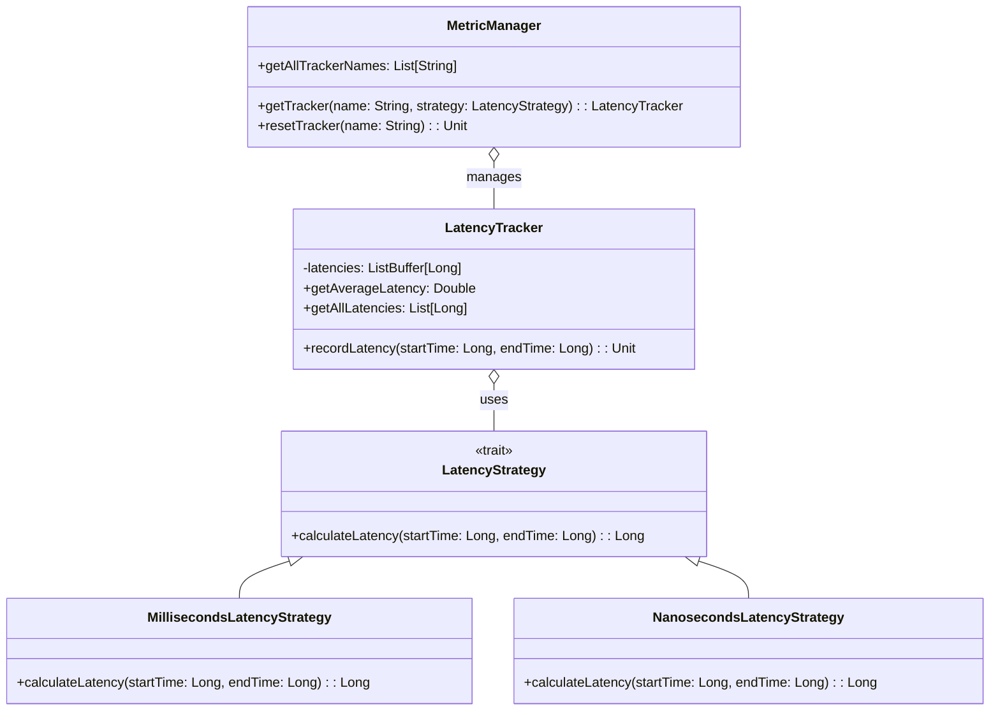

# **Observability Framework**

## Overview

This project implements a simple and extensible framework for latency observability using the Strategy Pattern in Scala. It allows you to define different latency calculation strategies and manage multiple metric trackers flexibly.

---

## Tech Stack

- **Language** -> Scala 3.6.3
- **Build Tool** -> sbt 1.10.11
- **Runtime** -> JDK 25
- **Testing** -> ScalaTest 3.2.16

---

## Architecture Diagram



---

## Setup Instructions

### 1 - Clone

```bash
git clone https://github.com/rbleggi/tech-pocs.git
cd scala-3/observability-framework
```

### 2 - Build

```bash
sbt compile
```

### 3 - Test

```bash
sbt test
```
