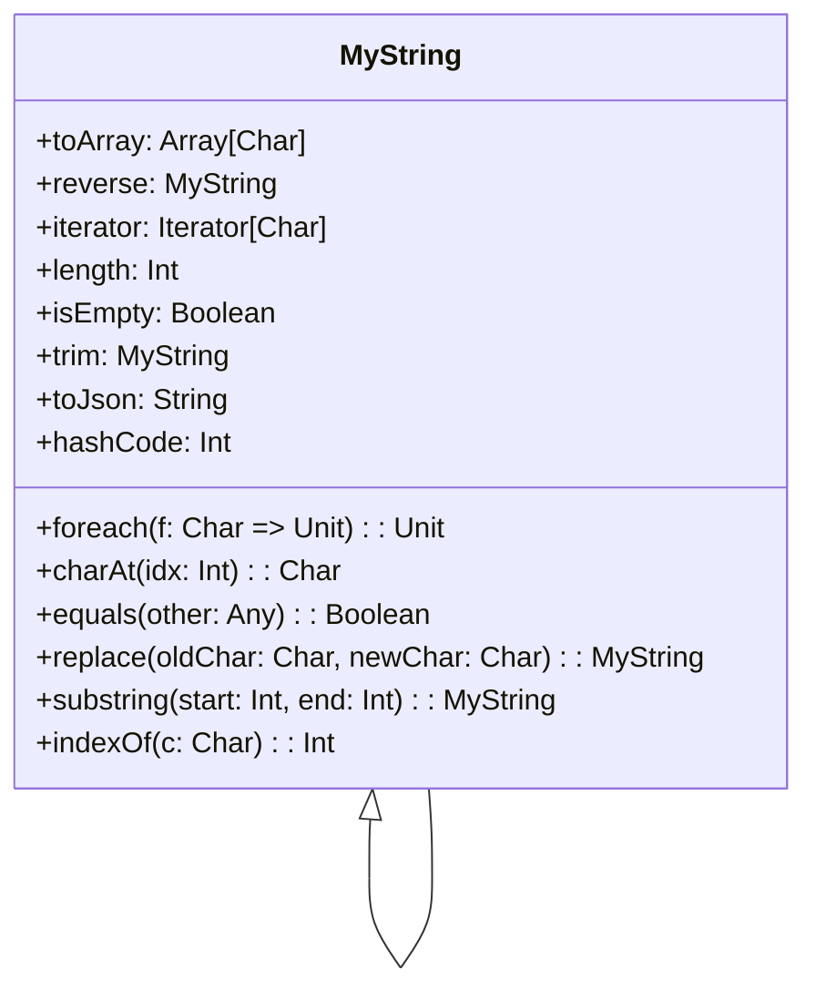

# **Own String Implementation**

## **Overview**

This project demonstrates a custom String implementation in Scala. The solution uses the Decorator Pattern to extend and encapsulate string operations in a single class, providing methods like toArray, foreach, reverse, iterator, length, charAt, equals, isEmpty, replace, substring, trim, toJson, indexOf, and hashCode.

---

## **Tech Stack**

- **Scala 3** → Modern JVM-based language with advanced type safety and functional programming features.
- **SBT** → Scala's official build tool.
- **JDK 21** → Required to run the application.

---

## **Features**

- **Terminal Interaction** → Run and test all string methods in the terminal.
- **Decorator Pattern** → Extensible design for custom string operations.
- **Single File Implementation** → All logic is contained in one file for simplicity.

---

## **Architecture Diagram**



---

## **Implementation Details**

- The solution uses the Decorator Pattern: MyString wraps a standard String and adds custom methods.
- The main entry point is `@main def run(): Unit =`, which demonstrates all implemented methods.
- All logic is in a single Scala file, with no comments.
- To test, run the application and observe the output for each method.

---

## **Setup Instructions**

### **1️ - Clone the Repository**

```bash
git clone https://github.com/rbleggi/tech-pocs.git
cd scala-3/own-string-impl
```

### **2️ - Compile & Run the Application**

```bash
./sbtw compile run
```

### **3️ - Run Tests**

```bash
./sbtw test
```
