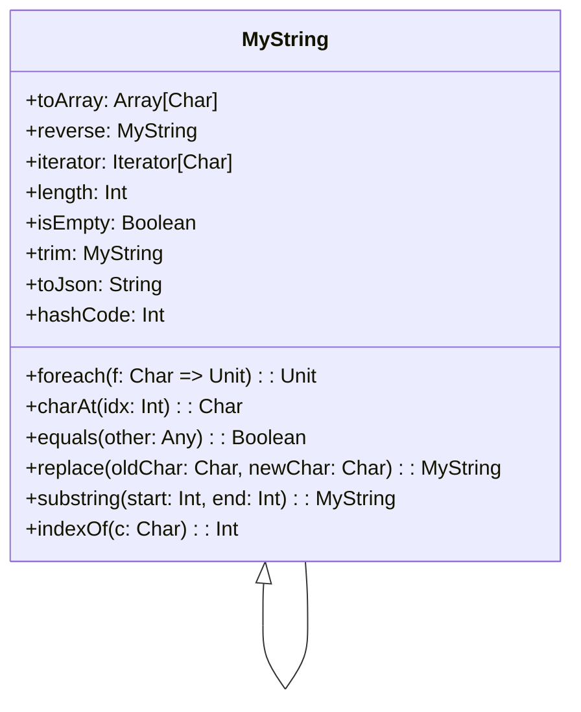

# **Own String Implementation**

## Overview

This project demonstrates a custom String implementation in Scala. The solution uses the Decorator Pattern to extend and encapsulate string operations in a single class, providing methods like toArray, foreach, reverse, iterator, length, charAt, equals, isEmpty, replace, substring, trim, toJson, indexOf, and hashCode.

---

## Tech Stack

- **Language** -> Scala 3.6.3
- **Build Tool** -> sbt 1.10.11
- **Runtime** -> JDK 25
- **Testing** -> ScalaTest 3.2.16

---

## Architecture Diagram


```mermaid
classDiagram
    direction TB

    class MyString {
        +toArray: Array[Char]
        +foreach(f: Char => Unit): Unit
        +reverse: MyString
        +iterator: Iterator[Char]
        +length: Int
        +charAt(idx: Int): Char
        +equals(other: Any): Boolean
        +isEmpty: Boolean
        +replace(oldChar: Char, newChar: Char): MyString
        +substring(start: Int, end: Int): MyString
        +trim: MyString
        +toJson: String
        +indexOf(c: Char): Int
        +hashCode: Int
    }

    MyString <|-- MyString
```

---

## Setup Instructions

### 1 - Clone

```bash
git clone https://github.com/rbleggi/tech-pocs.git
cd scala-3/own-string-impl
```

### 2 - Build

```bash
sbt compile
```

### 3 - Test

```bash
sbt test
```
