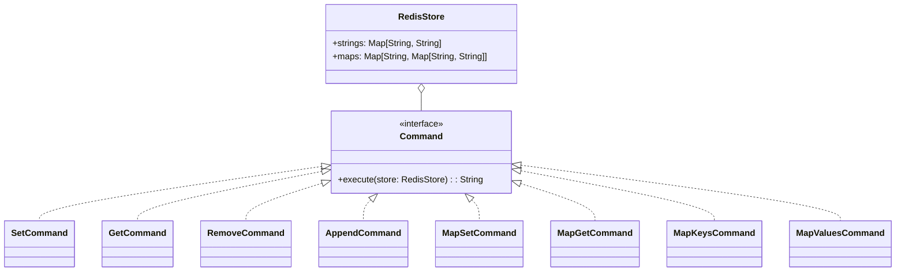

# **Redis Clone System**

## **Overview**

This project implements a **simple in-memory Redis-like key-value store** using the **Command Pattern**. It supports basic string and map operations, similar to a minimal Redis server.

### **Tech Stack**

- **Scala 3.6** → Modern JVM-based language with functional programming support.
- **SBT** → Scala's official build tool.
- **JDK 21** → Required to run the application.

---

## **Features**

- **String Operations** → set, get, remove, append
- **Map Operations** → mapset, mapget, mapkeys, mapvalues
- **Command Pattern** → Each operation is encapsulated as a command for easy extension
- **In-Memory Store** → All data is stored in memory (no persistence)

---

## **Architecture Diagram**



---

## **Command Pattern**

The **Command Pattern** encapsulates each operation (set, get, remove, append, mapset, mapget, mapkeys, mapvalues) as a command object. This allows:

- Each action is implemented as a separate `Command`.
- Easy extension with new commands without modifying existing code.
- Clean separation between the invoker (main loop) and the receiver (`RedisStore`).
- Simple and maintainable code structure.

---

## **Setup Instructions**

### **1️ - Clone the Repository**

```shell
git clone https://github.com/rbleggi/tech-pocs.git
cd scala-3/note-taking
```

### **2️ - Compile & Run the Application**

```shell
./sbtw compile run
```

### **3️ - Run Tests**

```shell
./sbtw compile test
```