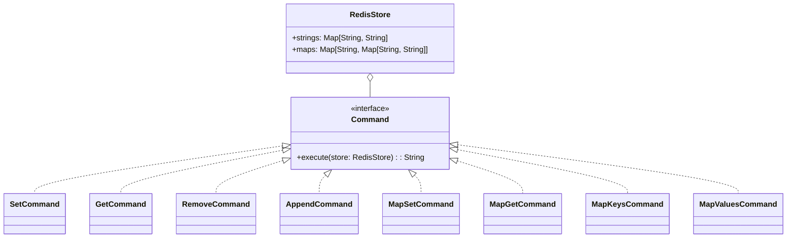

# **Redis Clone System**

## Overview

This project implements a simple in-memory Redis-like key-value store using the Command Pattern. It supports basic string and map operations, similar to a minimal Redis server.

---

## Tech Stack

- **Language** -> Scala 3
- **Build Tool** -> sbt
- **Testing** -> ScalaTest 3.2.16
- **JDK** -> 25

---

## Architecture Diagram


```mermaid
classDiagram
    direction TB
    class Command {
        <<interface>>
        +execute(store: RedisStore): String
    }
    class RedisStore {
        +strings: Map[String, String]
        +maps: Map[String, Map[String, String]]
    }
    Command <|.. SetCommand
    Command <|.. GetCommand
    Command <|.. RemoveCommand
    Command <|.. AppendCommand
    Command <|.. MapSetCommand
    Command <|.. MapGetCommand
    Command <|.. MapKeysCommand
    Command <|.. MapValuesCommand
    RedisStore o-- Command
```

---

## Setup Instructions

### 1 - Clone

```bash
git clone https://github.com/rbleggi/tech-pocs.git
cd scala-3/redis-clone
```

### 2 - Build

```bash
sbt compile
```

### 3 - Test

```bash
sbt test
```
