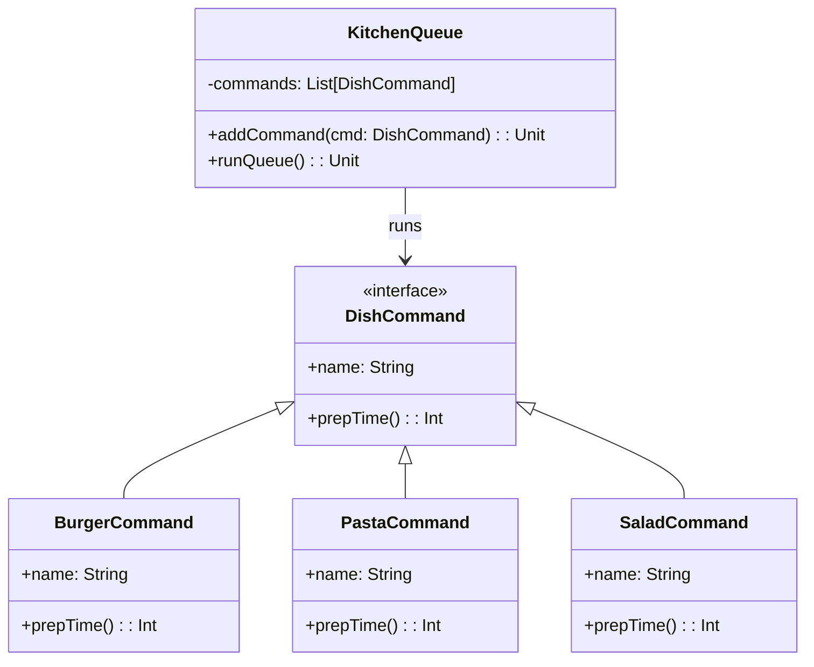

# **Restaurant Queue**

## **Overview**

This project implements a **modular restaurant queue system** using the **Command Pattern**. Each **dish preparation**
is encapsulated in a separate command that knows how long it takes to prepare. The system queues these commands and
reports the total and per-dish prep time.

---

## **Tech Stack**

- **Scala 3** → Modern JVM-based language with advanced type safety and functional programming features.
- **SBT** → Scala's official build tool.
- **JDK 21** → Required to run the application.

---

## **Features**

- **Command Pattern** → Every dish is a self-contained command
- **Per-Dish Time Calculation** → Each dish has its own logic
- **Queue Execution** → Prepare dishes in order and track timing
- **Easily Extensible** → Add more dishes without touching core logic
---

## **Architecture Diagram**



---

## **Command Pattern**

The **Command Pattern** lets us model each dish as a command that knows:

- How to describe itself (name)
- How long it takes to prepare (prep time)

This separates dish logic from execution flow.

---

## **Setup Instructions**

### **1️ - Clone the Repository**

```bash
git clone https://github.com/rbleggi/tech-pocs.git
cd scala-3/restaurant-queue
```

### **2️ - Compile & Run the Application**

```bash
./sbtw compile run
```

### **3️ - Run Tests**

```bash
./sbtw test
```