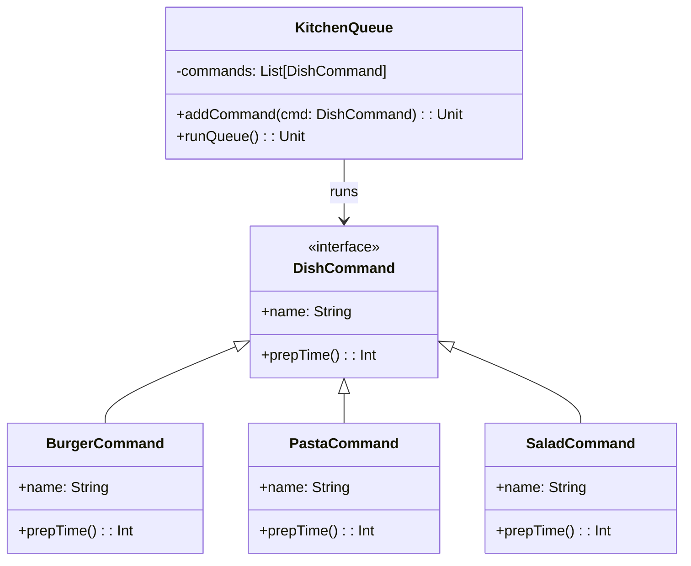

# **Restaurant Queue**

## Overview

This project implements a modular restaurant queue system using the Command Pattern. Each dish preparation is encapsulated in a separate command that knows how long it takes to prepare. The system queues these commands and reports the total and per-dish prep time.

---

## Tech Stack

- **Language** -> Scala 3
- **Build Tool** -> sbt
- **Testing** -> ScalaTest 3.2.16
- **JDK** -> 25

---

## Architecture Diagram


```mermaid
classDiagram
    direction TB

    class DishCommand {
        <<interface>>
        +name: String
        +prepTime(): Int
    }

    class BurgerCommand {
        +name: String
        +prepTime(): Int
    }

    class PastaCommand {
        +name: String
        +prepTime(): Int
    }

    class SaladCommand {
        +name: String
        +prepTime(): Int
    }

    class KitchenQueue {
        -commands: List[DishCommand]
        +addCommand(cmd: DishCommand): Unit
        +runQueue(): Unit
    }

    DishCommand <|-- BurgerCommand
    DishCommand <|-- PastaCommand
    DishCommand <|-- SaladCommand
    KitchenQueue --> DishCommand: runs
```

---

## Setup Instructions

### 1 - Clone

```bash
git clone https://github.com/rbleggi/tech-pocs.git
cd scala-3/restaurant-queue
```

### 2 - Build

```bash
sbt compile
```

### 3 - Test

```bash
sbt test
```
