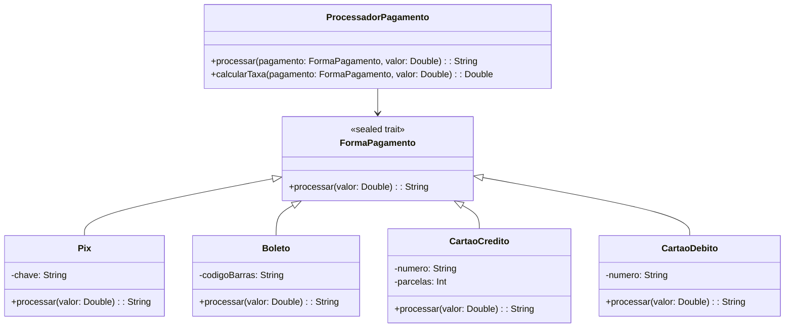

# **Sealed Traits Pattern**

## **Overview**

This project demonstrates Scala 3's sealed traits with exhaustive pattern matching using a Brazilian payment system. Sealed traits ensure type safety by restricting inheritance to the same file and enabling compile-time completeness checking in pattern matching.

---

## **Tech Stack**

- **Scala 3.6.3** → Modern JVM language with advanced type safety and functional programming.
- **SBT 1.10.11** → Scala build tool.
- **JDK 25** → Java runtime environment.
- **ScalaTest 3.2.16** → Testing framework.

---

## **Architecture Diagram**



---

## **Setup Instructions**

### 1 - Clone the Repository

```bash
git clone https://github.com/rbleggi/tech-pocs.git
cd scala-3/sealed-traits
```

### 2 - Compile & Run the Application

```bash
sbt compile run
```

### 3 - Run Tests

```bash
sbt test
```
