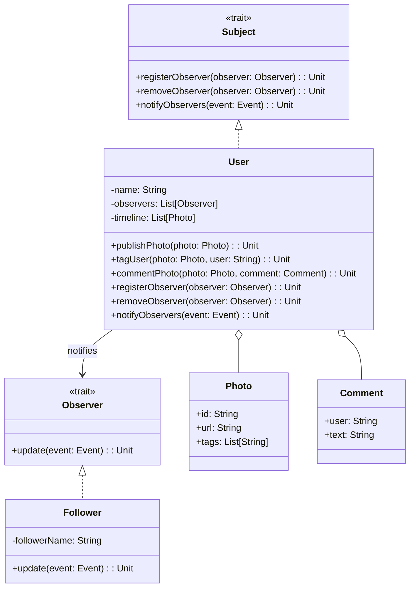

# **Social Media Sharing Photo App**

## Overview

A modular social media photo sharing PoC in Scala 3, demonstrating core features (publish, tag, timeline, comments) and event-driven notifications using the Observer Pattern. Followers are notified when users publish, tag, or comment on photos.

---

## Tech Stack

- **Language** -> Scala 3
- **Build Tool** -> sbt
- **Testing** -> ScalaTest 3.2.16
- **JDK** -> 25

---

## Architecture Diagram


```mermaid
classDiagram
    direction TB

    class Subject {
        <<trait>>
        +registerObserver(observer: Observer): Unit
        +removeObserver(observer: Observer): Unit
        +notifyObservers(event: Event): Unit
    }

    class Observer {
        <<trait>>
        +update(event: Event): Unit
    }

    class User {
        -name: String
        -observers: List[Observer]
        -timeline: List[Photo]
        +publishPhoto(photo: Photo): Unit
        +tagUser(photo: Photo, user: String): Unit
        +commentPhoto(photo: Photo, comment: Comment): Unit
        +registerObserver(observer: Observer): Unit
        +removeObserver(observer: Observer): Unit
        +notifyObservers(event: Event): Unit
    }

    class Follower {
        -followerName: String
        +update(event: Event): Unit
    }

    class Photo {
        +id: String
        +url: String
        +tags: List[String]
    }

    class Comment {
        +user: String
        +text: String
    }

    Subject <|.. User
    Observer <|.. Follower
    User o-- Photo
    User o-- Comment
    User --> Observer : notifies
```

---

## Setup Instructions

### 1 - Clone

```bash
git clone https://github.com/rbleggi/tech-pocs.git
cd scala-3/social-media-photo-app
```

### 2 - Build

```bash
sbt compile
```

### 3 - Test

```bash
sbt test
```
