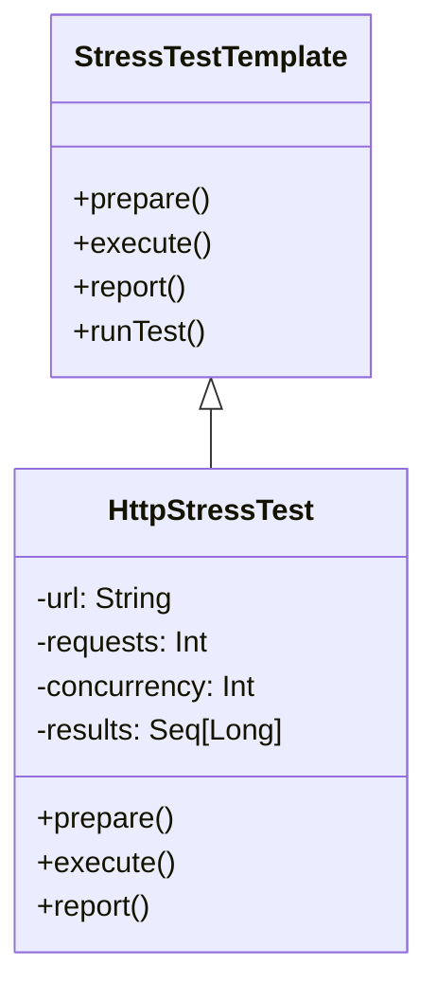

# **HTTP Stress Test Framework**

## **Overview**

This project implements a **stress test framework for HTTP endpoints**. It allows users to configure the number of requests, concurrency level, and target URL to evaluate the performance and reliability of HTTP services under load.

The solution utilizes the **Template Method Pattern** to structure the stress test workflow, ensuring extensibility and clear separation of preparation, execution, and reporting phases.

---

## **Tech Stack**

- **Scala 3** → Modern JVM-based language with advanced type safety and functional programming features.
- **SBT** → Scala's official build tool.
- **JDK 21** → Required to run the application.

---

## **Features**

- **Configurable HTTP Stress Testing** → Set target URL, number of requests, and concurrency level.
- **Performance Metrics** → Reports total requests, average, minimum, and maximum response times.
- **Template Method Pattern** → Organizes the test workflow for extensibility and clarity.
- **Single File Implementation** → All logic is contained in one Scala file for simplicity.
- **Scalability** → Easily extendable to support additional protocols or test strategies.

---

## **Architecture Diagram**



---

## **Setup Instructions**

### **1️ - Clone the Repository**

```bash
git clone https://github.com/rbleggi/tech-pocs.git
cd scala-3/http-server
```

### **2️ - Compile & Run the Application**

```shell
./sbtw compile run
```

### **3️ - Run Tests**

```shell
./sbtw compile test
```